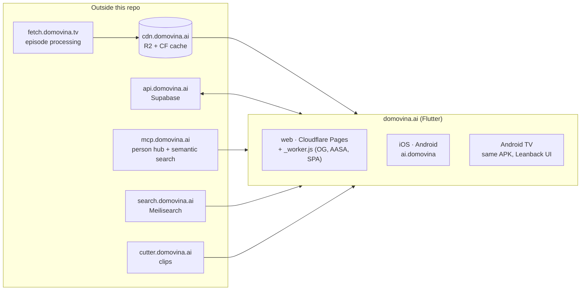
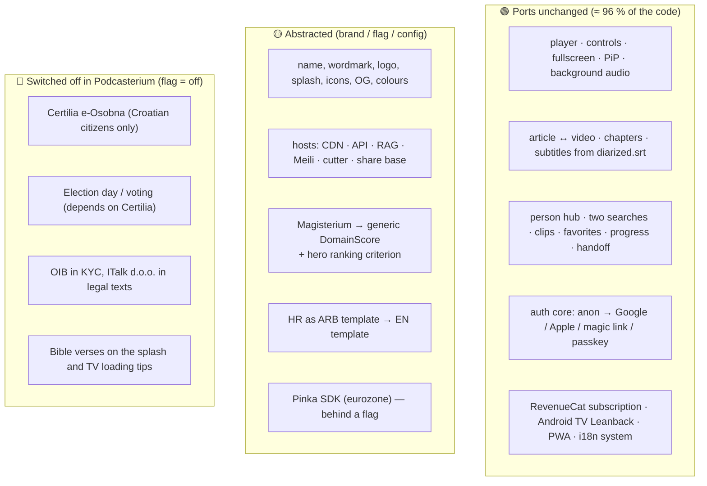

# 00 — Analysis of the source application DOMOVINA.ai

*Measured on `domovina.ai` `main` @ `cfb45aa` (v2.0.148+170), 10 September 2026,
Flutter 3.47.3 / Dart 3.13.3. Every number is reproduced by §9.*

This is the third iteration of the analysis; the first two are
`domovina.ai/docs/podcasterium_analysis_report.md` (14 Aug 2026, Croatian)
and `…/podcasterium_technical_manual.md`. This document does **not repeat**
what still holds there. Instead it (a) refreshes the numbers on today's HEAD
and (b) shifts the question from *"can it be done"* to *"what exactly to touch
to get a standalone app under another name"*.

---

## 1. What the application is, in three sentences

1. **A read-only client over a static CDN contract.** All content (JSON,
   images, MP4/MP3) comes from `cdn.domovina.ai`; the app knows nothing about
   processing. The pipeline that turns a raw podcast into an article, chapters
   and speakers lives in `fetch.domovina.tv` and is not part of the client.
2. **Supabase on the side for everything user-owned** — identity, favorites,
   progress, subscription, votes, channel ownership — via `api.domovina.ai`
   (self-hosted GoTrue + PostgREST + edge functions).
3. **Three UIs from one codebase**: responsive web/mobile (`screens/`),
   Android TV Leanback (`screens/tv/`), and a "simple" reader
   (`episode_simple_screen.dart`).



---

## 2. Inventory (refreshed)

| Measure | 14 Aug 2026 (7de73ea) | **10 Sep 2026 (cfb45aa)** |
| :-- | --: | --: |
| Version | 2.0.136+158 | **2.0.148+170** |
| Dart files in `lib/` (excluding l10n) | 227 | **229** |
| LOC excluding generated l10n | 55,945 | **58,648** |
| Translation keys (ARB, HR template) | 977 | **1,010** |
| Test files | 26 | **38** |
| `flutter test` | +228 −2 | **+331 −2** (same two known failures) |
| Largest file | `episode_screen.dart` 2,683 | **3,050** |
| Commits | — | 529 |

The two failures are the same as in August and are tracked in
`.nightly/test-baseline.txt`: `test/widget_test.dart` (smoke test breaks on
`HttpClient` in the test binding) and `test/home_feed_test.dart` (expects
`hiQualityRecent`, gets `hiQuality`). The second matters for Podcasterium: it
is the **only test** over the featured-episode selection algorithm, which the
rebrand has to change (§4).

### What changed since August

Between 7de73ea and cfb45aa: a navigation stack with scroll restoration
(go_router, `optionURLReflectsImperativeAPIs`), virtual channels (people as
channels), "Show all" on the people rail, 12 new test files. None of it
changes the conclusions about domain coupling; all of it is in the green
bucket (§3).

---

## 3. Domain coupling — how much code is "Croatian/Catholic"

The August measure (lines mentioning a domain term) repeated on today's HEAD,
excluding `lib/l10n/`:

| Term | Lines | Files | What it is |
| :-- | --: | --: | :-- |
| `pinka` | 645 | 36 | Creator support (SEPA QR + on-chain), isolated SDK in `lib/pinka_sdk/` |
| `magisterium` | 604 | 39 | Score of alignment with Catholic doctrine + 3 generations of formats |
| `vote` | 306 | 12 | "Election day" — channel voting, tied to the Croatian eID |
| `domovina` | 213 | 81 | Name, domain in share/OG/legal links, scheme, log prefix |
| `croBlue` / `croRed` | 84 / 37 | 35 / 17 | Brand tokens (navy #002F6C, red #FF0000) |
| `certilia` | 77 | 9 | e-Osobna (NIAS eID) — works only for Croatian citizens |
| `glasanje` | 70 | 16 | Voting routes and UI |
| `OIB` | 3 | 1 | KYC field (Croatian personal ID number) |

Roughly **2,000 lines out of 58,648 (≈ 3.5 %)**, with overlaps. The app is
still almost domain-neutral — the numbers are practically the same as in
August even though the codebase grew 5 %.

**Where `domovina` actually is in the code** (81 files, 213 lines):

| Kind | Examples | Count |
| :-- | :-- | --: |
| Hard-coded hosts | `https://domovina.ai` in share links, `cdn.`, `mcp.`, `search.`, `cutter.`, `certilia.` | 22 + 6 + 2 + 1 + 1 + 1 occurrences |
| Name in page titles | `'… – DOMOVINA.ai'` in `setPageMeta` (episode, channel, person, pinka) | 6 |
| Wordmark | `home_app_bar.dart:_Wordmark`, `auth_ui.dart` — `'DOMOVINA'` + `'.ai'` in red | 2 |
| Identifiers | `ai.domovina://auth/callback`, `ai.domovina/tv_mode`, `ai.domovina.audio` | 9 lines / 8 files |
| Store links | `app_install_banner.dart` — App Store id `6781716801`, Play `id=ai.domovina` | 2 |
| App class | `DominovinaApp` in `main.dart` | 5 |
| Entitlement | `kDomovinaPlusEntitlement = 'domovina_plus'`, text "DOMOVINA Plus" | 4 |
| Comments | — | the rest |

The conclusion is the same as in August, now with a sharper consequence:
**the name and the domain are not centralized**. There is `CdnConfig.base`
for the CDN, but `https://domovina.ai` for share/OG/legal, `mcp.domovina.ai`
for the person hub and search, the App Store/Play IDs and the scheme are all
written at the point of use. That is the first job (see
`02-brand-layer-and-rebranding.md`).

---

## 4. Three buckets — what ports, what gets abstracted, what gets switched off



### 🟡 Magisterium — the only thing that is not just presentation

The score enters two algorithms, not only badges:

- `screens/home/home_feed.dart` — featured-episode selection is 4-tiered and
  **the first three tiers require `hasMagisterium`**. The DOMOVINA.ai home
  page picks its hero from ≈ 10 % of the corpus (in August 311 of 3,175
  episodes). For Podcasterium, where there will be no scores, tiers 1–3 would
  always be empty and the hero would fall to tier 4 ("newest episode without
  processing"). **The ranking criterion must be replaced**, not just renamed.
- `screens/home/sort_mode.dart` — `ChannelSortMode.magisterium` is one of
  five channel sort modes.

The rest (39 files) is presentation: a badge on a card, a panel on the
episode, TV variants. `CdnConfig` has 9 URL builders for Magisterium files
(3 generations + EN overlay + prompts) — in Podcasterium they are not called
when the domain layer is off, so the `EpisodeData.load` fan-out drops from 17
to ≈ 8 fetches per episode (a side benefit).

### 🔴 The red bucket is small in code, large in configuration

Certilia: 77 lines, 9 files, but also a **path dependency** in `pubspec.yaml`
(`flutter_certilia: path: ../../stepanic/flutter_certilia`). A fresh clone
of the repo without that sibling directory **does not pass `flutter pub get`**.
For Podcasterium the dependency is either removed together with the Certilia
service or switched to a git dependency. This is a concrete blocker for a
standalone repo and goes into phase 0 (`07-roadmap-and-estimates.md`).

Voting (`/glasanje`, `voting_rail.dart`, `voting_service.dart`) depends on
Certilia (1 verified citizen = 1 vote) and on Supabase tables that are a
snapshot of the Croatian podcast registry. Flagged off; 12 files.

---

## 5. Platform layer — what carries the `ai.domovina` identity

This is the list the August analysis did not have, and it is central to
"new bundle ID and package name". Every location was verified with `grep` (§9).

| Platform | File | Contains |
| :-- | :-- | :-- |
| Android | `android/app/build.gradle.kts` | `namespace = "ai.domovina"`, `applicationId = "ai.domovina"` |
| Android | `android/app/src/main/AndroidManifest.xml` | `android:label="DOMOVINA"`, App Links host `domovina.ai` (allowlist of 9 paths), custom scheme `ai.domovina`, Leanback banner |
| Android | `android/app/src/main/kotlin/ai/domovina/MainActivity.kt` | `package ai.domovina`, MethodChannel `ai.domovina/tv_mode` |
| Android | `android/app/src/main/res/values/colors.xml` | `splash_bg #002F6C` |
| Android | `android/app/src/main/res/drawable-nodpi/splash_full_1.png` | 4K splash with a Bible verse |
| Android | `android/key.properties`, `android/upload-keystore.jks` | upload key (gitignored) |
| iOS | `ios/Runner.xcodeproj/project.pbxproj` | `PRODUCT_BUNDLE_IDENTIFIER = ai.domovina` (3× Runner + 3× RunnerTests), `DEVELOPMENT_TEAM = 6SCK58757K`, `IPHONEOS_DEPLOYMENT_TARGET = 15.0`, `TARGETED_DEVICE_FAMILY = "1,2"` |
| iOS | `ios/Runner/Info.plist` | `CFBundleDisplayName`/`CFBundleName` = DOMOVINA.ai, URL scheme `ai.domovina`, `UIBackgroundModes audio`, `ITSAppUsesNonExemptEncryption=false` |
| iOS | `ios/Runner/Runner.entitlements` | `applinks:domovina.ai`, `webcredentials:domovina.ai` |
| iOS | `ios/ExportOptions.plist` | `teamID 6SCK58757K`, `manageAppVersionAndBuildNumber=false` |
| iOS | `ios/Runner/Assets.xcassets/LaunchImage.imageset` | still the **default Flutter placeholder** (known TODO from `docs/release-mobile.md`) |
| macOS | `macos/Runner/Configs/AppInfo.xcconfig` | `PRODUCT_NAME = DOMOVINA.ai`, `PRODUCT_BUNDLE_IDENTIFIER = ai.domovina` |
| Web | `web/index.html` | title, OG/Twitter meta, JSON-LD, `apple-itunes-app app-id=6781716801`, boot-intro HTML with description and ITalk footer, Cloudflare analytics token, Corbado `passkeys_bundle.js` |
| Web | `web/manifest.json` | name/short_name, `theme_color #002F6C` |
| Web | `web/_worker.js` (1,529 lines) | `CDN`, `SITE`, `PERSON_API` constants; `AASA_JSON` (`6SCK58757K.ai.domovina` + airKUNA wallet), `ASSETLINKS_JSON` (`ai.domovina` + SHA-256), WebAuthn related origins, OG injection, Cal.com proxy, sitemap |
| Web | `wrangler.toml` | `name = "domovina-ai"` (Pages project) |
| Flutter | `pubspec.yaml` | `name: domovina_ai`, assets `domovina_ai_logo*`, `splash/` |
| Flutter | `flutter_launcher_icons.yaml` | icon source, `theme_color #002F6C` |
| Flutter | `lib/l10n/app_hr.arb` / `app_en.arb` | `appTitle` + 25 keys containing "DOMOVINA" |
| Scripts | `scripts/play-upload.sh`, `store-status.rb`, `build-mobile-release.sh`, `testflight-upload.sh` | `PKG=ai.domovina`, `BUNDLE_ID`, ASC key id `25KYCN22QD`, issuer |
| launchd | `launchd/ai.domovina.*.plist` | job names |

In total **≈ 25 files outside `lib/`** carry the identity. All are mechanical
replacements, but each has a consequence outside the repo (a new ASC app, a
new Play app, new OAuth clients, a new keystore) — covered by
`03-identities-and-platforms.md`.

---

## 6. Build and release — what already exists and what is reused

The upstream repo has a **fully scripted** path to both stores, and that is
the biggest saving for Podcasterium:

| Path | Script | State |
| :-- | :-- | :-- |
| Web build + deploy + CDN purge + verification | `scripts/deploy.sh` | production; bumps the version itself |
| iOS IPA without the Xcode GUI (ASC API-key signing) | `scripts/build-mobile-release.sh ios` | production; bypasses `flutter build ipa`, which fails at export |
| Android AAB | `scripts/build-mobile-release.sh android` | production |
| TestFlight upload | `scripts/testflight-upload.sh` | `altool` + API key |
| Play internal/production upload | `scripts/play-upload.sh`, `play-promote.sh` | Play Developer API, service account |
| Store state | `scripts/store-status.rb` | read-only, `--max-build` for nightly |
| Nightly build from a worktree → TestFlight + Play internal | `scripts/nightly-build.sh` + launchd | tests are a hard gate |
| Store screenshots | `scripts/asc-upload-screenshot.rb`, `store-assets/` | 7 iPhone, 4 iPad, 7 Android |

All scripts hard-code the identity (`ai.domovina`, ASC key id, Pages project)
— parameterizing them is a few hours of work and is described in
`04-build-and-deploy.md`.

There is no cloud CI: `.github/workflows/` only renders the DBML schema.
Everything is built on a Mac mini under launchd. For Podcasterium that is
fine to start with, but it is a **single point of failure** worth naming.

---

## 7. What must not be left out of the decision — corpus and language

Repeated from August because it is still the largest item, and it is not in
this repo:

- **The pipeline writes Croatian regardless of the source language.** An
  English podcast (Sub Club, 178 episodes) has English audio and a Croatian
  article. A global Podcasterium with that content has no product outside
  Croatia.
- The first Podcasterium version will, realistically, **show the same corpus**
  as DOMOVINA.ai (same CDN) — just under another name. That is a legitimate
  first step (a white-label proof that the build, identities and stores work),
  but it must be called what it is. See `06-backend-and-corpus.md`.

---

## 8. Conclusion of the analysis

1. The application is **portable**: ≈ 96 % of the code knows no Croatian or
   religious term. Nothing about that changed since August.
2. What is not centralized is not domain features but **name and hosts** —
   81 files mention `domovina`. The first engineering job is a brand/config
   layer, not a rebrand.
3. **Three real blockers for a standalone repo**: the `flutter_certilia` path
   dependency, Magisterium as the hero ranking criterion, and ≈ 25 platform
   files with identity that pull in new accounts/keys outside the repo.
4. The release pipeline is done and is reused by parameterization.
5. The real cost of a global product is in the pipeline (output language,
   multi-tenancy), not in the client — and that cost must not block the first
   standalone build.

---

## 9. How to verify every number

All commands run from `/Users/ms/git/domovinatv/domovina.ai`.

```bash
git rev-parse --short HEAD                      # cfb45aa
grep '^version:' pubspec.yaml                   # 2.0.148+170
flutter --version | head -1                     # Flutter 3.47.3

# §2 inventory
find lib -name '*.dart' -not -path '*/l10n/*' | wc -l                     # 229
find lib -name '*.dart' -not -path '*/l10n/*' | xargs wc -l | tail -1     # 58648
python3 -c "import json;d=json.load(open('lib/l10n/app_hr.arb'));print(len([k for k in d if not k.startswith('@')]))"  # 1010
ls test/*.dart | wc -l                                                    # 38
flutter test --reporter=compact 2>&1 | tail -1                            # +331 -2
wc -l lib/screens/episode_screen.dart                                     # 3050
git log --oneline | wc -l                                                 # 529

# §3 domain coupling
for t in pinka magisterium vote domovina croBlue croRed certilia glasanje OIB; do
  printf '%-12s %5s lines %3s files\n' "$t" \
    "$(grep -ri "$t" lib --include=*.dart | grep -v /l10n/ | wc -l | tr -d ' ')" \
    "$(grep -ril "$t" lib --include=*.dart | grep -v /l10n/ | wc -l | tr -d ' ')"
done
grep -rhoE "https?://[a-z0-9.-]+\.(ai|tv|finance)" lib --include=*.dart | grep -v l10n | sort | uniq -c | sort -rn
grep -rn "ai\.domovina" lib --include=*.dart | grep -v /l10n/ | wc -l     # 9
grep -c "DOMOVINA" lib/l10n/app_en.arb                                    # 26

# §4 Magisterium in algorithms
grep -n "Tier\|hasMagisterium" lib/screens/home/home_feed.dart | head
grep -n "magisterium" lib/screens/home/sort_mode.dart
grep -c "static String magisterium" lib/services/cdn_config.dart          # 9 builders
grep -n "flutter_certilia" pubspec.yaml                                   # path: ../../stepanic/…

# §5 platform identity
grep -rn "ai\.domovina\|domovina\.ai\|DOMOVINA" android ios web macos \
  --include=*.xml --include=*.kts --include=*.plist --include=*.swift \
  --include=*.kt --include=*.json --include=*.html --include=*.entitlements \
  --include=*.pbxproj --include=*.xcconfig | grep -v /Pods/ | cut -d: -f1 | sort -u
grep -c domovina web/_worker.js                                           # 38
wc -l web/_worker.js                                                      # 1529

# §6 release scripts
ls scripts/*.sh scripts/*.rb
ls .github/workflows                                                      # only render-dbml*
```
