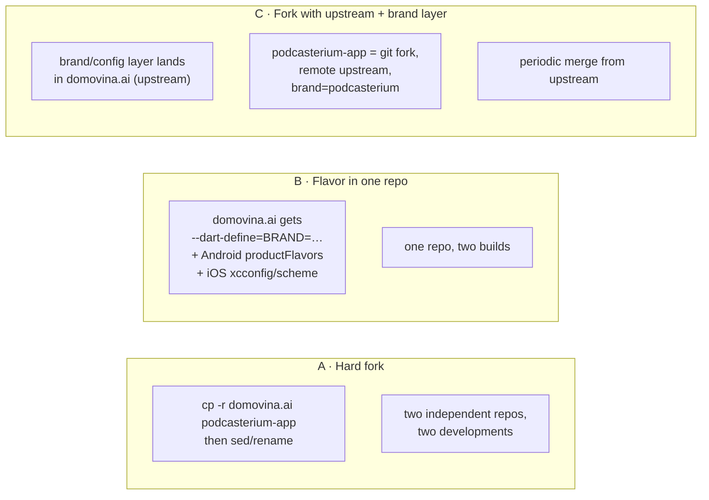
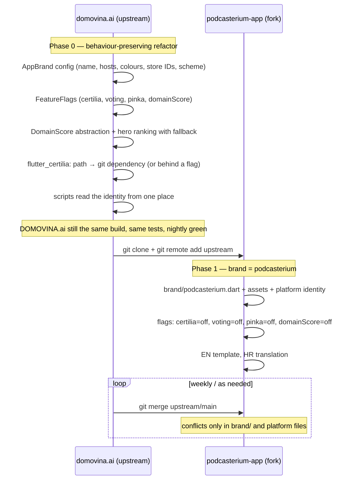

# 01 — Strategy: how to get two applications out of one codebase

*The decision to make before a single commit.*

> **Superseded (10 Sep 2026).** The owner ruled out any fork: development
> continues in `domovina.ai` and Podcasterium must follow it without a second
> git history. The recommendation in §4 is replaced by
> `08-white-label-architecture.md` (core package + thin app shells). The
> comparison in §2–§3 remains valid background.

---

## 1. What is being asked

A standalone **Podcasterium** application — web, iOS, Android — under a new
bundle ID and package name, on the App Store and Google Play, with its own
brand. DOMOVINA.ai **keeps living** unchanged: it has users, store listings,
a nightly build, Election day, Pinka, Certilia.

So this is not a rebrand (swapping one name for another) but a **second
product from the same code**. That immediately raises the question: one repo
or two?

---

## 2. Three options



| Criterion | A · Hard fork | B · Flavor | C · Fork + upstream |
| :-- | :-- | :-- | :-- |
| Effort to the first Podcasterium build | smallest (a day or two of sed) | medium (brand layer + flavors) | medium (brand layer, then fork) |
| Pulling fixes from DOMOVINA.ai | **manual, diverges within a week** | automatic (same code) | `git merge upstream/main`, conflicts only in the brand layer |
| Risk of breaking DOMOVINA.ai | none | **real** — every flavor commit touches the live app | low — the brand layer is a behaviour-preserving refactor |
| Different backend / corpus later | trivial | via config, but the same repo carries both | trivial |
| Separate repo, team, CI, issue tracker | yes | no | **yes** |
| What happens when Podcasterium gets a feature DOMOVINA does not want | free | flag hell in one repo | free; upstream need not know |
| Removing the red bucket (Certilia, voting, Pinka) | `rm -rf` | flag | flag or `rm` in the fork |

---

## 3. Why not A and why not B

**A (hard fork) is a trap that looks like a saving.** `sed 's/domovina/podcasterium/'`
across 81 files gives a build the same day. But DOMOVINA.ai has 529 commits
in 6 months — ≈ 3 per day — and most are fixes to the player, navigation, web,
TV that Podcasterium **wants**. Without a shared git history every cherry-pick
is done by hand over diverged files. In a month the two repos are two products.

**B (flavor) is technically the cleanest but wrong for this situation.**
Flutter flavors solve exactly this problem for apps that are *the same product
with another logo*. Podcasterium is not that: it intends to switch off whole
subsystems (voting, Certilia, Pinka, Magisterium), change the home-page
ranking criterion, change the template language, and eventually target a
different backend. Each of those decisions would, in the flavor model, be an
`if (brand == …)` in DOMOVINA.ai's live code, and every Podcasterium commit
would pass through the DOMOVINA nightly gate and vice versa. Also: the owner
has already opened a separate repo `podcasterium-app` — a separate product,
team and responsibility.

---

## 4. Recommendation: C — fork with upstream, but the brand layer goes upstream FIRST

The order matters and is not intuitive:



**Why the brand layer goes upstream and not into the fork:**

1. The refactor is **tested on the live application** with users and the
   nightly build. If `AppBrand.shareBase` replaces 22 hard-coded
   `https://domovina.ai` and something breaks, DOMOVINA.ai sees it the same
   day. In the fork it would surface only once Podcasterium has users.
2. The fork then changes **one file** (`lib/brand/podcasterium.dart`) plus the
   platform identity, instead of 81 files. Every later `merge upstream` passes
   without conflicts in `lib/` because upstream does not touch brand constants.
3. DOMOVINA.ai gets cleaner code with no change in behaviour — that is value
   even without Podcasterium.

**What the fork may do freely:** delete the red bucket instead of flagging it,
add its own features, change the backend. The price is that merging from
upstream gets harder over time; that is acceptable and normal for a fork.

**What the fork must NOT do:** touch `lib/` outside `brand/` in phase 1. Every
such diff is a future merge conflict.

---

## 5. What goes into the brand layer (overview; details in `02-…`)

```dart
// lib/brand/app_brand.dart  (upstream)
abstract final class AppBrand {
  static const name = String.fromEnvironment('BRAND', defaultValue: 'domovina');
  static BrandConfig get config => switch (name) {
    'podcasterium' => podcasteriumBrand,
    _ => domovinaBrand,
  };
}

class BrandConfig {
  final String appName;          // 'DOMOVINA.ai' | 'Podcasterium'
  final String wordmark;         // 'DOMOVINA' + '.ai' accent | 'Podcasterium'
  final String wordmarkAccent;   // '.ai' | ''
  final String siteBase;         // https://domovina.ai | https://podcasterium.…
  final String cdnBase;          // cdn.domovina.ai  (same in phase 1)
  final String ragBase;          // mcp.domovina.ai
  final String meiliBase;        // search.domovina.ai
  final String cutterBase;       // cutter.domovina.ai
  final String urlScheme;        // ai.domovina | <new>
  final String iosAppStoreId;    // 6781716801 | <new>
  final String androidPackage;   // ai.domovina | <new>
  final Color seed;              // #002F6C | <new>
  final Color accent;            // #FF0000 | <new>
  final String entitlement;      // domovina_plus | podcasterium_plus
  final String plusDisplayName;  // 'DOMOVINA Plus' | 'Podcasterium Plus'
  final String logoAsset;        // assets/brand/<brand>/logo_1024.png
  final Locale templateLocale;   // hr | en
  final FeatureFlags flags;
}

class FeatureFlags {
  final bool certilia, voting, pinka, domainScore, channelOwnership, calBooking;
}
```

Everything that is `--dart-define` today (SUPABASE_URL, MEILI_URL, RC keys…)
stays `--dart-define` — those are *secrets and environment*, not brand. Brand
is what gets committed.

---

## 6. Consequences for this repository

Until phase 0 is finished upstream, `podcasterium-app` stays documentation.
When it is:

```bash
cd /Users/ms/git/podcasterium
rm -rf podcasterium-app/.git          # (or: new repo on GitHub, then push)
git clone git@github.com:domovinatv/ai.domovina.tv.git podcasterium-app
cd podcasterium-app
git remote rename origin upstream
git remote add origin git@github.com:<org>/podcasterium-app.git
# docs/ from this repo move to docs/podcasterium/ in the fork
```

The documents from this repo move into the fork as `docs/podcasterium/` so
that the paths they cite (`lib/…`, `android/…`) are the same as in the code
they sit next to. They are translated already — upstream docs are Croatian,
this repository is English only (`CLAUDE.md`).
