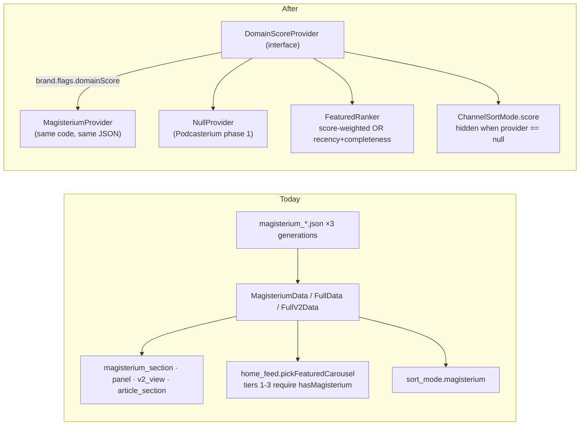

# 02 — Brand layer and frontend rebranding

*What exactly in `domovina.ai` carries a name, colour, logo or domain, and how
to gather it in one place. Paths are from the upstream repo @ `cfb45aa`.*

Goal of phase 0 (upstream): **no file outside `lib/brand/` may contain the
literal `DOMOVINA`, `domovina.ai`, `ai.domovina`, `#002F6C` or `#FF0000`.**
Once that holds, Podcasterium is one new file in `lib/brand/` plus assets
plus platform identity (`03-…`).

---

## 1. Inventory — Dart layer

### 1.1 Name and titles

| Location | Today | Becomes |
| :-- | :-- | :-- |
| `lib/main.dart:213,232` | `title: 'DOMOVINA.ai'` (MaterialApp ×2) | `AppBrand.config.appName` |
| `lib/main.dart:167` | `class DominovinaApp` | `class PodcastApp` (neutral; the "Dominovina" typo disappears on the way) |
| `lib/main.dart:36` | `print('[DOMOVINA v$appVersion] …')` | prefix from brand |
| `lib/services/page_meta.dart` + 6 calls `setPageMeta(title: '… – DOMOVINA.ai')` in `episode_screen.dart`, `episode_simple_screen.dart`, `channel_screen.dart`, `person_screen.dart`, `pinka_campaign_screen.dart` | suffix hard-coded at the call site | `page_meta.dart` appends `' – ${brand.appName}'` itself; callers pass only the specific part |
| `lib/screens/home/home_app_bar.dart:364` `_Wordmark` | `'DOMOVINA'` + `'.ai'` in `tertiary` (red) | `brand.wordmark` + `brand.wordmarkAccent` (empty string = no accent) |
| `lib/onboarding/ui/auth_ui.dart:45` | the same wordmark, second copy | **one** `BrandWordmark` widget in `lib/widgets/`, used by both |
| `lib/screens/tv/tv_home_screen.dart:447`, `tv_episode_screen.dart:1050` | `'DOMOVINA.ai'` literal | `brand.appName` |
| `lib/screens/subscribe/paywall_screen.dart:208`, `account_screen.dart:291` | `'DOMOVINA Plus'` | `brand.plusDisplayName` |
| `lib/services/background_audio.dart:44-45` | `androidNotificationChannelId: 'ai.domovina.audio'`, name `'DOMOVINA.ai player'` | `'${brand.androidPackage}.audio'`, `'${brand.appName} player'` |
| `lib/pinka_sdk/src/wallet/pinka_wallet_stub.dart:8,17` | "DOMOVINA wallet…" in error text | generic text or brand |

### 1.2 Hosts — 8 places today, needs to be 1

| Host | Where it is today | Occurrences |
| :-- | :-- | --: |
| `https://domovina.ai` (share base, legal links, invite, OG) | `share_context_menu.dart`, `clip_share_sheet.dart`, `episode_screen.dart`, `channel_card.dart`, `person_card.dart`, `favorites_rail.dart`, `followed_rail.dart`, `persons_rail.dart`, `account_screen.dart`, `channel_ownership_screen.dart`, `pinka_config.dart` (`shareBaseUrl`), `vote_candidate.dart`, `cal_booking_service.dart`, `passkey_service.dart`, … | 22 |
| `https://cdn.domovina.ai` | `services/cdn_config.dart` (`CdnConfig.base`) — **already centralized**; but `person_hub.dart`, `cached_thumbnail.dart`, `person_index_cache.dart`, `pinka_*` reference it in comments/regexes | 1 + references |
| `https://mcp.domovina.ai` | `person_service.dart`, `search_service.dart`, `person_index_cache.dart`, `person_hub.dart` | 6 |
| `https://search.domovina.ai` | `meili_client.dart` (default for `MEILI_URL`) | 2 |
| `https://cutter.domovina.ai` | `clip_service.dart`, `clip_share_sheet.dart` | 1 |
| `https://certilia.domovina.ai` | `certilia_service.dart` | 1 |
| `mpt.domovina.ai`, `wallet.domovina.ai` | `pinka_config.dart` | 2 |
| `api.domovina.ai` | only through the `SUPABASE_URL` dart-define — **already correct** | 0 in code |

Proposal: one `Endpoints` object in `BrandConfig` (`site`, `cdn`, `rag`,
`meili`, `cutter`). `CdnConfig.base` stays as the API but reads from it. Every
function that builds a share URL calls `brand.shareUrl(path)`.

Rule for `web/_worker.js` (1,529 lines, 38 mentions): the worker is **not**
parameterized at runtime — the Cloudflare Pages project is per brand, so the
worker takes its constants from `env` bindings (`SITE`, `CDN`, `PERSON_API`,
`APPLE_TEAM_ID`, `IOS_BUNDLE_ID`, `ANDROID_PACKAGE`, `ANDROID_SHA256`) with
defaults set to today's values. One worker, two Pages projects.

### 1.3 Identifiers in Dart

| Location | Today |
| :-- | :-- |
| `lib/services/auth_service.dart:337,500` | `'ai.domovina://auth/callback'` |
| `lib/services/tv_mode.dart:20` | `MethodChannel('ai.domovina/tv_mode')` — must match `MainActivity.kt` |
| `lib/services/app_install_banner.dart:11-14` | App Store `id6781716801`, Play `id=ai.domovina` |
| `lib/services/revenue_cat/rc_models.dart:12` | `kDomovinaPlusEntitlement = 'domovina_plus'` |

All move into `BrandConfig` (`urlScheme`, `iosAppStoreId`, `androidPackage`,
`entitlement`). The MethodChannel name can stay brand-neutral (`app/tv_mode`)
on both sides — simpler than parameterizing Kotlin.

### 1.4 Colours

`lib/theme/app_theme.dart` has exactly two tokens: `croRed` (#FF0000) and
`croBlue` (#002F6C). Everything else goes through
`ColorScheme.fromSeed(seedColor: croBlue)` + `tertiary: croRed`. That is
**excellent** for a rebrand — but 35 files call `AppTheme.croBlue` and 17
`AppTheme.croRed` directly instead of `scheme.primary` / `scheme.tertiary`.

Proposal in two steps:
1. Rename `croBlue → brandPrimary`, `croRed → brandAccent` and fill them from
   `brand.seed` / `brand.accent`. Mechanical, 52 files, zero behaviour change
   for DOMOVINA.
2. Later (not blocking): where possible replace direct calls with `scheme.*`
   so dark/light variants stay consistent.

Outside Dart, colours also live in: `android/…/values/colors.xml` (`splash_bg`,
`ic_launcher_background`), `web/index.html` (`theme-color`, boot-intro CSS
`#002F6C` / `#001a3d`), `web/manifest.json`, `flutter_launcher_icons.yaml`.
All generated by one script from the brand manifest (§3).

### 1.5 Typography

Playfair Display (display), Lora (bodyLarge), Inter (UI) via `google_fonts`,
`lib/theme/typography.dart`. The editorial serif is part of the DOMOVINA
identity ("premium editorial vibe"). Podcasterium **may keep** the same system
— typography is not domain-coloured — or swap families. If it swaps: the
`_usedVariants` list must follow (CLAUDE.md rule: every new family/weight goes
into preload, otherwise the first frame flashes the fallback), and the
`web/index.html` `<link>` for the boot-intro needs the same families.

Recommendation: **do not change fonts** in phase 1. Colours, logo and name
give 90 % of the perceived difference; fonts are risk without gain.

### 1.6 Illustrations and widgets with domain content

| Location | What | Podcasterium |
| :-- | :-- | :-- |
| `lib/widgets/hrvatska_zastavica.dart` | CustomPaint Croatian flag; used only by `voting/widgets/streak_flags.dart` | disappears with voting (flag) |
| `lib/screens/tv/widgets/tv_loading_tips.dart` | TV loading tips; some reference Bible verses and DOMOVINA.ai | tips from brand (`brand.loadingTips`) or generic |
| `lib/screens/tv/widgets/tv_boot_splash.dart` + `assets/splash/splash_full_1.png` | 4K splash with Mt 10:26-27 | `assets/brand/<brand>/splash_full.png`, generated by `scripts/generate-premium-splash-taglines.py` with another tagline list |
| `assets/icons/domovina_ai_logo.svg` / `_1024.png` | logo = Croatian tricolour + "AI graph" | `assets/brand/<brand>/logo.svg`, `logo_1024.png` |
| `assets/icons/og-image.svg`, `web/og-image.png`, `og-image-square.png` | OG images | per brand |
| `assets/icons/tv_banner.svg`, `android/…/drawable-xhdpi/tv_banner.png` | Leanback banner 320×180 | per brand |
| `web/index.html` boot-intro | HTML description "transcribes, summarizes and analyzes Croatian Catholic podcasts…", ITalk footer with OIB | text from brand manifest; footer operator from manifest |

### 1.7 Strings (ARB)

`lib/l10n/app_hr.arb` is the template (1,010 keys), `app_en.arb` the
translation. 26 keys in EN contain "DOMOVINA". Two separate jobs:

1. **Name out of the strings.** Keys that interpolate the app name get a
   `{app}` placeholder (`"plusTitle": "{app} Plus"`), and the call passes
   `brand.appName`. 26 keys, an hour of work, zero change for the user.
2. **Template language.** For a global product EN must be the template
   (`l10n.yaml: template-arb-file: app_en.arb`). That is a change of
   **process**, not code: whoever adds a string adds it to EN first. Croatian
   ICU plurals (one/few/other) → English (one/other) is the direction that
   loses no information. If done upstream, the DOMOVINA team must agree to
   write EN first; if not, the fork changes `l10n.yaml` and accepts conflicts
   in the ARB on merge. **Recommendation: the l10n.yaml swap goes into the
   fork, not upstream.**

Domain strings (Magisterium scale, voting, Certilia, Pinka, OIB) stay in the
ARB and are simply never rendered in Podcasterium because the flags are off.
No need to delete them; `gen-l10n` does not charge for them.

---

## 2. Domain layer → `DomainScore`

The only place where the rebrand touches **logic**. Details in the August
analysis (`podcasterium_analysis_report.md` §3); here only what goes into
phase 0.



Minimal change:

1. `home_feed.dart`: the ranking takes a `ScoreFn? score`. When `null`, tiers
   1–3 rank by **processing completeness** (has article + chapters + speakers)
   and recency instead of the Magisterium score. That is a better fallback for
   DOMOVINA anyway (the hero currently picks from 10 % of the corpus).
2. `home_feed_test.dart` is **fixed first** (the only test over this;
   currently failing) and extended with the `score == null` case.
3. `sort_mode.dart`: `magisterium` → `score`, and the UI does not offer it
   when the flag is off.
4. Presentation widgets (39 files) are **not touched** in phase 0 — they are
   gated on `hasMagisterium`, which in Podcasterium is always `false` because
   `DataService` skips the Magisterium fetches when the flag is off. That is
   9 of 17 parallel fetches fewer per episode.

Renaming `Magisterium*` classes to `DomainScore*` is cosmetic and **does not
go into phase 0** — a 39-file diff for zero behaviour change is a merge
conflict nobody needs.

---

## 3. Brand manifest — one source for everything that is not Dart

Dart gets `BrandConfig`; but icons, splash, manifest.json, colors.xml,
index.html meta, `flutter_launcher_icons.yaml` and the store listing are files
that are **generated**. Proposal:

```
brand/
  domovina/
    brand.yaml          # name, colours, domain, scheme, store IDs, operator, description
    logo.svg            # master
    logo_1024.png
    og-image.png        # 1200×630
    og-image-square.png
    tv_banner.png       # 320×180
    splash_taglines.txt # for generate-premium-splash-taglines.py
  podcasterium/
    brand.yaml
    …
scripts/apply-brand.sh <brand>
```

`apply-brand.sh` writes from `brand.yaml`: `flutter_launcher_icons.yaml` →
runs `dart run flutter_launcher_icons`; `web/manifest.json`;
`android/…/colors.xml`; the meta block in `web/index.html` (between markers);
copies assets into `assets/brand/`; generates splash PNGs. Idempotent, the
result is committed. "Changing the brand" thus becomes
`./scripts/apply-brand.sh podcasterium && git diff`.

Platform identity (`applicationId`, `PRODUCT_BUNDLE_IDENTIFIER`, scheme,
entitlements) is **deliberately not** in this script — it changes once at fork
time and must not be overwritten by accident (see `03-…`).

---

## 4. What the Podcasterium brand has to decide (not engineering)

| Decision | Why it blocks | Proposal |
| :-- | :-- | :-- |
| Name and wordmark | ARB placeholders, `appName`, store listing, domain | "Podcasterium", no suffix/accent (wordmarkAccent = '') |
| Domain | share base, OG, AASA, App Links, passkey RP ID, OAuth redirects — **everything** | choose and buy before phase 1; changing later means reinstall for App Links and loss of passkeys |
| Primary + accent colour | seed for the whole M3 palette, splash, icon, `theme-color` | one cool neutral + one warm accent; **not** red/blue (keeps the Croatian association) |
| Logo | icon (adaptive + iOS 1024), TV banner, OG, favicon | must work at 48 px monochrome on the TV Apps row |
| Tone of splash taglines | replacement for Bible verses | 10–14 generic sentences about reading podcasts; no religious or national references |
| Legal entity / operator | footer in `index.html`, privacy, terms, store "seller" | if still ITalk d.o.o., the text stays; only the product name changes |
| UI template language | `l10n.yaml` | EN |
| Default UI language and default content language | `LocaleController` default `hr`; `EpisodeLanguage` default `hr` | EN / source language (once the pipeline writes in the source language; until then HR because nothing else exists) |

---

## 5. How to check that phase 0 is done

```bash
# upstream, after the refactor — everything must be 0 except lib/brand/
grep -rn "DOMOVINA\|domovina\.ai\|ai\.domovina" lib --include=*.dart \
  | grep -v "^lib/brand/" | grep -v "/l10n/" | grep -v "^\s*//" | wc -l
grep -rn "0xFF002F6C\|0xFFFF0000" lib --include=*.dart | grep -v "^lib/brand/" | wc -l
grep -n "DOMOVINA" lib/l10n/app_en.arb | wc -l        # 0 — everything through {app}
flutter test                                         # +333 −1 or better (home_feed fixed)
./scripts/apply-brand.sh domovina && git status --porcelain | wc -l   # 0 — idempotent
```
