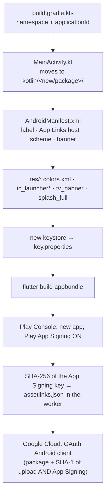
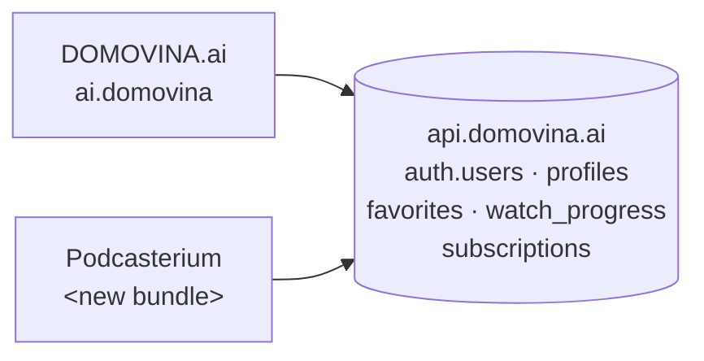

# 03 — Identities and platform configuration

*Everything that changes once, at fork time, and that pulls in accounts and
keys outside the repo. Paths are from `domovina.ai` @ `cfb45aa`.*

---

## 1. New identities — decide before anything else

| Identity | DOMOVINA.ai today | Podcasterium (proposal) | Note |
| :-- | :-- | :-- | :-- |
| Domain | `domovina.ai` | **`podcasterium.com`** (decided 10 Sep 2026; registered 19 Sep 2026 through Cloudflare Registrar — §8) | Everything below depends on it |
| iOS bundle ID | `ai.domovina` | **`com.podcasterium`** (decided 10 Sep 2026) | Cannot change after the first upload to ASC |
| Android applicationId | `ai.domovina` | **`com.podcasterium`** — the same string as the bundle ID | Play locks it forever; must be a valid Java package with ≥ 2 segments — `com.podcasterium` satisfies both |
| Android namespace / Kotlin package | `ai.domovina` | `com.podcasterium` | `MainActivity.kt` moves to `kotlin/com/podcasterium/` |
| Custom URL scheme | `ai.domovina://` | **`com.podcasterium://`** (mirrors the bundle ID, like upstream; confirmed 19 Sep 2026) | Used by the Supabase native OAuth/magic-link return; must be registered in the GoTrue allow-list |
| Apple Team | `6SCK58757K` (ITalk d.o.o.) | **same team `6SCK58757K`** (decided 19 Sep 2026) | If same: AASA can carry both apps; passkeys share webcredentials only on the same domain (they don't). If new: new ASC API key, new agreements, new banking details |
| App Store app id | `6781716801` | assigned when the app record is created — **still open**, the record cannot be created over the API (§8) | goes into `app_install_banner.dart` and the `apple-itunes-app` meta |
| Play app | **created** 23 Sep 2026 by the owner under **ITalk Ltd.** (Play account `7441230488937961517`, app `4973577890360482607`). The first AAB went up through the Developer API, not the console: a new app accepts an API upload as long as the release is `draft`; it was then promoted to `completed` on the internal track. All ten App content declarations and the store category (Entertainment) are done; the store graphics are not | `GET …/applications/com.podcasterium/edits/{id}/tracks/internal` |
| Android upload keystore | `android/upload-keystore.jks`, alias `upload` | **generated 19 Sep 2026**, alias `upload` (§8) | Separate key per app; loss = reset via Play support |
| RevenueCat | project with 2 store apps, entitlement `domovina_plus` | **project `Podcasterium` created 19 Sep 2026** with entitlement `podcasterium_plus` (§8) | An RC app is tied to the bundle ID; products are created in ASC/Play under the new app |
| Supabase project | `api.domovina.ai` (self-hosted, Coolify) | **same project in phase 1** | See §5 — consequences for user data |
| Cloudflare Pages project | `domovina-ai` | `podcasterium`, **created 19 Sep 2026** with 9 env bindings (§8) | New `wrangler.toml` name; same `_worker.js` with another env binding |
| Cloudflare zone | `domovina.ai` (`CLOUDFLARE_ZONE_ID` in `.env`) | `podcasterium.com` zone, **active 19 Sep 2026** on the same account (§8) | `deploy.sh` purges the zone; the zone ID lives in `.env`, never in `docs/` |
| Cloudflare Web Analytics token | `84ead45314724f59905c5a5ccbd19bd1` in `index.html` | new site | — |
| Corbado passkeys | `passkeys_bundle.js` + RP ID `domovina.ai` | new RP ID = new domain | Passkeys are bound to the RP ID — **they do not transfer** |
| Meilisearch search key | deterministic read-only key | same (same index in phase 1) | — |
| Telegram nightly group | `TELEGRAM_CHAT_ID` | new group or the same chat with a prefix | `telegram-notify.rb` redacts secrets; keep it |
| launchd jobs | `ai.domovina.nightly-build`, `.build-volume`, `.voting-drift` | `com.podcasterium.nightly-build` (no voting-drift) | Two nightlies on the same Mac mini → different time (e.g. 02:30) so they don't fight over Xcode |

---

## 2. Android — files and steps



| File | Change |
| :-- | :-- |
| `android/app/build.gradle.kts:23,38` | `namespace`, `applicationId` |
| `android/app/src/main/kotlin/ai/domovina/MainActivity.kt` | `git mv` to `kotlin/<new>/<package>/`, `package` line; align the MethodChannel name with `lib/services/tv_mode.dart:20` |
| `android/app/src/main/AndroidManifest.xml:22` | `android:label` |
| `…/AndroidManifest.xml:69` | `android:host` App Links — new domain; the path allowlist stays (`/`, `/channels`, `/v/`, `/m/`, `/c/`, `/p/`, `/handoff`), **without** `/glasanje*` |
| `…/AndroidManifest.xml:89` | custom `android:scheme` |
| `…/res/values/colors.xml` | `splash_bg` from the brand manifest |
| `…/res/drawable-nodpi/splash_full_1.png`, `drawable-xhdpi/tv_banner.png`, `mipmap-*/ic_launcher*`, `drawable-*/ic_launcher_foreground.png` | generated by `apply-brand.sh` (`flutter_launcher_icons` + splash script) |
| `android/key.properties` | new keystore path/alias/passwords (gitignored) |
| `android/upload-keystore.jks` | **do not copy the DOMOVINA key** — `keytool -genkeypair` a new one |

What stays untouched and why it matters that it stays: `EnableImpeller=false`
(performance on Amlogic TV boxes), the `AudioServiceActivity` parent, the
foreground service for audio, the Leanback intent filter and `uses-feature`
declarations, `queries` for url_launcher, `taskAffinity=""`, PiP. All of that
was paid for with measurements and does not depend on the brand.

**Gotcha (from `docs/release-mobile.md`)**: `assetlinks.json` must carry the
SHA-256 of the **Play App Signing** key, not the upload key — and that is only
known after Play generates the key on the first upload. Order: upload to
internal → Play Console → App integrity → copy SHA-256 → worker env → redeploy
the web → `adb shell pm verify-app-links`.

---

## 3. iOS — files and steps

| File | Change |
| :-- | :-- |
| `ios/Runner.xcodeproj/project.pbxproj` | `PRODUCT_BUNDLE_IDENTIFIER` ×3 (Runner) + ×3 (`RunnerTests` → `<new>.RunnerTests`); `DEVELOPMENT_TEAM` if new team |
| `ios/Runner/Info.plist:14,22` | `CFBundleDisplayName`, `CFBundleName` |
| `ios/Runner/Info.plist:83-86` | `CFBundleURLName` + `CFBundleURLSchemes` |
| `ios/Runner/Runner.entitlements` | `applinks:podcasterium.com`, `webcredentials:podcasterium.com` |
| `ios/ExportOptions.plist` | `teamID` if new; **keep** `manageAppVersionAndBuildNumber=false` (measured: Xcode otherwise overwrites the build number itself) |
| `ios/Runner/Assets.xcassets/AppIcon.appiconset` | generated by `flutter_launcher_icons` |
| `ios/Runner/Assets.xcassets/LaunchImage.imageset` | today the **default Flutter placeholder** for DOMOVINA too — an opportunity to do it properly for both |
| `macos/Runner/Configs/AppInfo.xcconfig` | `PRODUCT_NAME`, `PRODUCT_BUNDLE_IDENTIFIER`, copyright — macOS is not a store target, but the build must pass |

Prerequisites in App Store Connect (once, via the ASC REST API or the portal;
the pattern is in `docs/mobile-release-pipeline.md` "Prerequisites"):
1. Register the bundle ID with the **Associated Domains** capability (for
   applinks + webcredentials) and **Sign in with Apple** if Apple OAuth is used.
2. Create the app record (name, primary language **en-US**, SKU).
3. Create an ASC API key with the App Manager role (or reuse `25KYCN22QD` if
   same team) — `.p8` in `~/.appstoreconnect/private_keys/`.
4. App Review contact, age rating, category (Entertainment or Education).

`xcodebuild archive -allowProvisioningUpdates` with the API key creates the
distribution cert and profile for the new bundle ID by itself — that is why
the pipeline does not need the Xcode GUI (see `04-…`).

**Gotcha**: AASA (`/.well-known/apple-app-site-association`) is cached by the
Apple CDN; propagation of a new `appID` to a device takes up to a week or a
reinstall. Deploy the AASA on the new domain **before** the first TestFlight
build.

---

## 4. Web — files

| File | Change |
| :-- | :-- |
| `web/index.html` | title, description, canonical, OG/Twitter (8 meta), JSON-LD, `apple-mobile-web-app-title`, `apple-itunes-app` (new app id; **remove** until the app is live, otherwise Safari shows an empty banner), `theme-color`, boot-intro text and colours, legal footer, CF analytics token. Everything between markers that `apply-brand.sh` rewrites |
| `web/manifest.json` | name, short_name, description, theme_color |
| `web/_worker.js` | constants `CDN`, `SITE`, `PERSON_API`, `PERSONS_API` → `env.*` with defaults; `AASA_JSON` appIDs and `ASSETLINKS_JSON` package/SHA from env; **remove** the airKUNA wallet block and the `/glasanje` components for Podcasterium (or gate with an env flag); WebAuthn related-origins list (domovina ecosystem) → empty; Cal.com proxy (`/api/cal/*`) gated by the `calBooking` flag |
| `web/social-test.html` | per brand or dropped from the build |
| `web/robots.txt` | sitemap URL |
| `web/passkeys_bundle.js` | stays; the Corbado RP ID is configured in the Corbado project, not in the bundle |
| `wrangler.toml` | `name` |
| `web/icons/*`, `web/favicon.png`, `web/og-image*.png` | generated by `apply-brand.sh` |

**Rule that stays**: `web/_redirects` must not exist (it shadows
`env.ASSETS.fetch()` in the worker); the `_headers` cache strategy stays the
same.

---

## 5. Supabase (GoTrue) — what changes in the backend, not in the repo

Phase 1 shares `api.domovina.ai`. What that means:



| Item | Action |
| :-- | :-- |
| GoTrue **redirect allow-list** | add `<scheme>://auth/callback`, `https://<domain>/auth/callback`, `https://<domain>/login-callback`, local dev port |
| GoTrue `SITE_URL` | stays `https://domovina.ai` (there is one); magic-link mails must therefore use `emailRedirectTo` explicitly — `auth_service.dart:500` already does |
| **Google OAuth** | in the same GCP OAuth client add a new Android client (package + SHA-1 of upload **and** App Signing cert), a new iOS client (bundle ID), the web client gets a new authorized origin + redirect URI. Google **branding verification** requires a home page with a clear description and a privacy link — that is the reason for the boot-intro HTML in `index.html` and the legal footer; **repeat for the new domain** |
| **Sign in with Apple** | new Service ID for the web (return URL `https://api.domovina.ai/auth/v1/callback` stays), the new bundle ID must be in the group; the same Apple team simplifies |
| **Passkeys** | RP ID = domain → separate Corbado project or separate RP; `webauthn` related origins in the worker |
| **Certilia** | off — nothing |
| **E-mail templates** | mention DOMOVINA.ai; GoTrue has one set of templates per project → either brand-neutral text, or a hook that picks by `redirect_to` domain, or (phase 2) a separate GoTrue |
| **Profiles and data** | `auth.users` is shared. A user who signs in with Google in both apps **sees the same favorites and progress**. In phase 1 with the same corpus that is a feature. When the corpora diverge, `favorites`/`watch_progress` rows point at a `youtube_id` that does not exist in the other corpus — `favorites_resolver.dart` already tolerates missing episodes, but this needs confirming |
| **Entitlement** | the `subscriptions` table has an `entitlement` column; `EntitlementService` gates on `== kDomovinaPlusEntitlement`. Podcasterium reads `podcasterium_plus`. One user, two entitlements, two RC projects — works without a schema change |
| **RevenueCat webhook** | `domovina-api/supabase/functions/revenuecat-webhook` writes entitlement state; new RC project → add its webhook secret and map to the new entitlement string |
| **Anonymous users** | `signInAnonymously` per install — in both apps, independently. The `migrate_anon_data` RPC works per user; no collision |

All of this is configuration in the `domovina-api` repo and the GoTrue env on
Coolify, not in the client. There should be **one document in `domovina-api`**
listing all OAuth clients and redirects per application — today that is
scattered across `docs/authentication-setup-guide.md` and the backend prompts.

---

## 6. RevenueCat

Today's state (`docs/payments/provisioning-state.md`, `TODO-store-launch.md`):
an RC project with an iOS and an Android app, 3 products × 2 stores,
entitlement `domovina_plus`, offering `default` with `$rc_monthly` /
`$rc_annual` / `$rc_lifetime`, webhook + RTDN + App Store Server Notifications
connected.

For Podcasterium **that whole configuration is repeated** under the new bundle ID:

1. ASC: subscription group + 2 auto-renewable + 1 non-consumable under the new
   app. Apple: **the first subscription goes into review together with the app
   version** — plan it into the first submission.
2. Play: 2 subscriptions + 1 in-app product; prices per country (Play accepts
   no fallback — DOMOVINA is therefore available only in 21 eurozone
   countries; for a global product **this is a real decision**: USD/GBP/…
   price list).
3. RC: new app ×2, import products, entitlement `podcasterium_plus`, offering,
   public SDK keys → `.env` (`RC_PUBLIC_SDK_KEY_IOS/ANDROID`).
4. Webhook to the `domovina-api` edge function with a new secret.
5. Web: `RC_WEB_CHECKOUT_URL` (Web Billing) — still empty for DOMOVINA.

RevenueCat MCP tools are available in this environment and can do step 3
programmatically; steps 1–2 are the ASC/Play API or the consoles.

---

## 7. Checklist "identity is done"

State on 19 September 2026 (evidence for every tick in §8):

```
[x] podcasterium.com bought, zone on Cloudflare, DNS
[x] bundle ID = applicationId = com.podcasterium registered in ASC with Associated Domains
[x] new Android keystore generated, key.properties locally — BACKUP IN TWO PLACES STILL OWED
[ ] Play app created, Play App Signing ON, SHA-256 of the App Signing cert recorded
[~] GoTrue allow-list: scheme + web callback routes (committed in domovina-api, not yet live)
[ ] Google OAuth: Android (2 SHA-1) + iOS + web origin/redirect; branding verification started
[~] Sign in with Apple: bundle registered as its own primary consent; grouping with
    ai.domovina and the web Service ID still open
[ ] Corbado / WebAuthn project for the new domain
[~] RC project + entitlement (done) + store credentials + webhook secret (open)
[x] Cloudflare Pages project + env bindings for the worker (SITE, CDN, PERSON_API, APPLE_TEAM_ID, IOS_BUNDLE_ID, ANDROID_PACKAGE, ANDROID_SHA256)
[ ] AASA and assetlinks served from the new domain and passing the validators
    (curl https://<domain>/.well-known/apple-app-site-association | jq;
     https://developers.google.com/digital-asset-links/tools/generator)
[ ] launchd job names and times do not collide with the DOMOVINA nightly
[ ] ASC app record created (name, SKU, category) and its App Store ID in lib/brand.dart
```

`[~]` = started, not finished.

---

## 8. Status — 19 September 2026

Measured, not assumed. Every claim has the command that reproduces it. Secrets
and account-scoped identifiers (Cloudflare zone ID, keystore passwords) live in
`.env` and `android/key.properties`, never here; certificate fingerprints are
public by design — `assetlinks.json` publishes them.

| Item | State | How to check |
| :-- | :-- | :-- |
| `podcasterium.com` | **registered** 19 Sep 2026 14:23:34 UTC through Cloudflare Registrar | `whois podcasterium.com \| grep 'Creation Date'` |
| DNS | Cloudflare nameservers `jessica`/`nitin`, zone active on the same account as `domovina.ai` | `dig +short NS podcasterium.com` |
| Cloudflare Pages | project `podcasterium`, `podcasterium.pages.dev`, production branch `main`, compatibility date 2026-01-01, 9 bindings on **both** production and preview | `wrangler pages project list` |
| Pages bindings set | `SITE`, `APP_NAME`, `IOS_BUNDLE_ID`, `ANDROID_PACKAGE`, `ANDROID_SHA256`, `WEBAUTHN_ORIGINS`, `FEATURE_VOTING=false`, `FEATURE_CAL=false`, `FEATURE_AIRKUNA=false` | Pages → Settings → Environment variables |
| Pages bindings left at default | `CDN`, `PERSON_API`, `PERSONS_API`, `APPLE_TEAM_ID` — phase 1 shares the DOMOVINA backend and the Apple team, so the worker defaults are already correct | `docs/worker-env-bindings.md` upstream |
| Custom domain on Pages | `podcasterium.com` (apex) and `www.podcasterium.com` attached 19 Sep 2026; Cloudflare wrote both CNAMEs to `podcasterium.pages.dev`. **Live since the first deploy, 21 Sep 2026** — the 522 is gone and the worker serves the brand from the Pages bindings (`04-…` §2) | `dig +short podcasterium.com`; `curl -o /dev/null -w '%{http_code}\n' https://podcasterium.com/` |
| Apple team | `6SCK58757K` (ITalk d.o.o.); it is the only seed ID across all 68 bundle IDs on the account | `GET /v1/bundleIds` with `scripts/asc-token.rb` |
| Bundle ID `com.podcasterium` | **registered** 19 Sep 2026, record `MJMYPA86QA`, platform UNIVERSAL | `GET /v1/bundleIds` |
| Its capabilities | `IN_APP_PURCHASE`, `ASSOCIATED_DOMAINS`, `APPLE_ID_AUTH` (PRIMARY_APP_CONSENT) — the same three `ai.domovina` carries | `GET /v1/bundleIds/MJMYPA86QA/bundleIdCapabilities` |
| ASC app record | **created** 23 Sep 2026 by the owner in the console (the API refuses `POST /v1/apps`: *"The resource 'apps' does not allow 'CREATE'"*). App ID `6815415892`, SKU `com.podcasterium`, version `1.0.0`. Filled through the API the same day: listing text, URLs, categories, age rating (12+), price Free, availability (all territories except mainland China), App Review contact and notes; App Privacy published in the console | `GET /v1/apps/6815415892` |
| `iosAppStoreId` | `'6815415892'` in `lib/brand.dart` | `grep iosAppStoreId lib/brand.dart` |
| Android upload keystore | **generated** 19 Sep 2026: alias `upload`, RSA 2048, SHA384withRSA, `CN=Podcasterium`, valid until 4 Feb 2054. Not a copy of the DOMOVINA key | `keytool -list -v -keystore android/upload-keystore.jks` |
| Upload key SHA-256 | `D3:86:8D:12:4F:7C:DD:27:71:01:12:09:AD:B6:DB:75:7D:5E:2F:11:8B:EE:78:1C:0F:21:44:F7:9D:53:A4:02` | as above |
| Upload key SHA-1 | `FB:5D:6E:05:9A:CC:02:A3:D6:87:81:CB:32:19:35:B9:7A:88:C8:FF` — needed for the Google OAuth Android client | as above |
| Release signing | wired and proven: an 86.6 MB AAB built from this shell carries `CN=Podcasterium` | `apksigner verify --print-certs build/app/outputs/bundle/release/app-release.aab` |
| Play app | **not created** (owner decision 19 Sep 2026: wait for the name and icon). It goes under the same organization that holds `ai.domovina` — **ITalk Ltd.**, Play account `7441230488937961517`. The Play Developer API has no create-app call; the console is the only way | Play Console → app list |
| `ANDROID_SHA256` binding | App Signing key `E9:C7:28:5E:9E:B7:C8:13:7E:29:03:B0:AD:C7:EE:ED:1D:25:8B:34:79:ED:EF:AC:95:31:4B:9F:68:AE:8C:A7` plus the upload key, comma-separated, on production and preview; redeployed 23 Sep 2026 and live in `assetlinks.json`. App Signing SHA-1 (for the Google OAuth Android client): `43:00:08:D9:90:75:74:57:AB:64:F1:D0:9F:7D:A8:5B:90:7B:7C:23` | `curl -s https://podcasterium.com/.well-known/assetlinks.json` |
| RevenueCat | project `Podcasterium` (`proj9b6e08d9`), apps `Podcasterium (iOS)` / `Podcasterium (Android)`, entitlement `podcasterium_plus` — a separate project, not new apps in the DOMOVINA one | RC dashboard, or `list-projects` |
| RC store credentials | **not configured** — the ASC API key and the Play service account must be uploaded per project in the dashboard; RC can only copy them between apps inside one project | RC → app settings |
| RC products / offering | none yet; they follow the ASC and Play products (§6 steps 1–2) | — |
| GoTrue allow-list | `com.podcasterium://auth/callback` and `https://podcasterium.com/auth/callback` **live since 24 Sep 2026**: set with `domovina-api/scripts/coolify-env-set.sh ADDITIONAL_REDIRECT_URLS=… --recreate-service=supabase-auth` as the union of the 26 live entries and the two new ones (28). Until then every OAuth sign-in from Podcasterium fell back to `GOTRUE_SITE_URL` (`https://domovina.ai`). The Coolify API masks this value, so read the live list from the container, never from the API | `docker exec supabase-auth-… printenv GOTRUE_URI_ALLOW_LIST` |
| Google OAuth clients | **none** for the new package/bundle/origin; branding verification not started (§5, and `05-…` §7 — it took DOMOVINA weeks) | Google Cloud console |
| Corbado / passkeys | **no** project for the new RP ID | — |
| RC webhook | not connected to the `domovina-api` edge function | — |

### What blocks what

1. ~~**First Play upload**~~ — **done 23 Sep 2026**; the App Signing SHA-256
   is in `assetlinks.json`, so Android App Links can verify.
2. ~~**The ASC app record**~~ — **done 23 Sep 2026**; the App Store ID is in
   the brand. `apple-itunes-app` waits for the app to go live (`05-…` step
   10), and the subscription group waits for Plus (not in 1.0.0).
3. ~~**The first web deploy**~~ — **done 21 Sep 2026**. AASA and assetlinks
   are live on the domain, so the Apple CDN can start caching the new `appID`
   ahead of the first TestFlight build (§3 gotcha), and Google OAuth branding
   verification has a home page to verify. Caveat: the deploy needed
   `_worker.js` copied in from upstream by hand, which is an open
   architectural question (`04-…` §2).
4. **Android developer verification**: the Play Console warns that every app
   under ITalk Ltd. must be registered for it by **30 Sep 2026**. Podcasterium
   has no Play app yet, so nothing is at risk today, but a new app created
   after that date inherits the requirement.

### Sign in with Apple grouping — decided 23 Sep 2026: not grouped

`com.podcasterium` stays its own primary App ID with **`PRIMARY_APP_CONSENT`**.
Grouping it under `ai.domovina` would have given one Apple user the same
identifier in both apps, but Apple shows the *primary* app's icon, terms and
privacy policy in the sign-in sheet, so Podcasterium users would have seen
DOMOVINA.ai. The cost is that the same person signs in as two different users
across the brands (`DECISIONS.md`, 23 Sep 2026).
