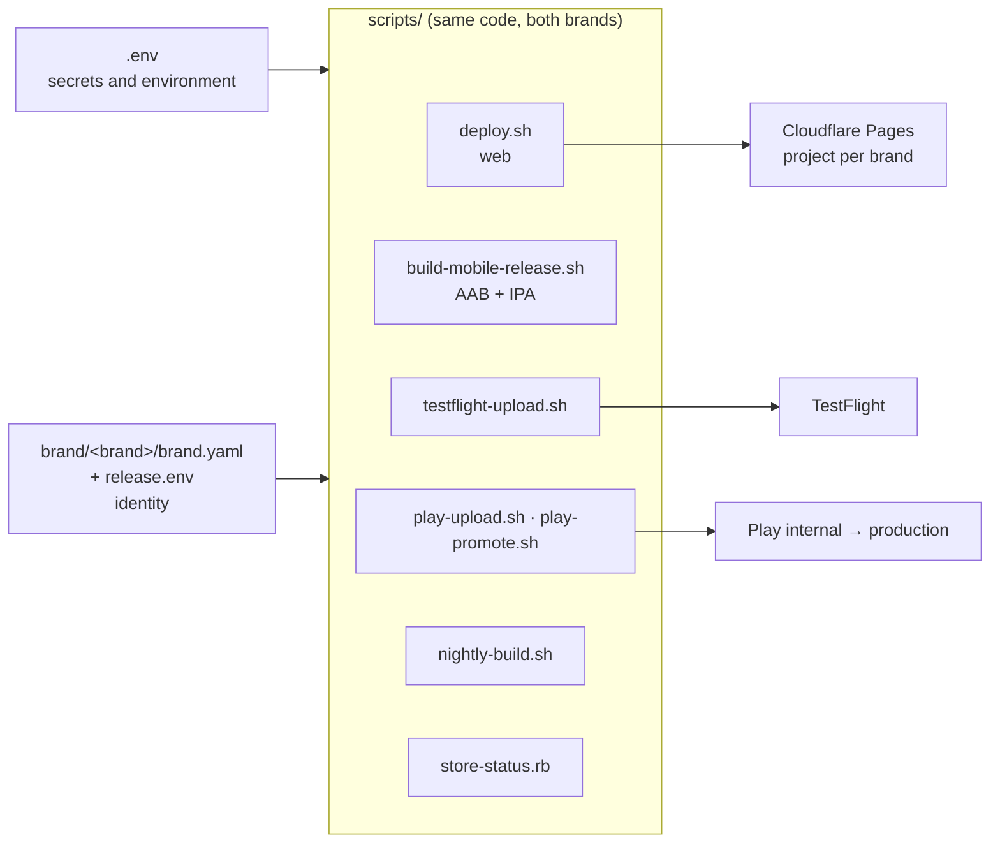

# 04 — Build and deploy pipeline

*What Podcasterium takes over from the DOMOVINA pipeline, what it
parameterizes, what it changes. Scripts are in `domovina.ai/scripts/` @ `cfb45aa`.*

---

## 1. Principle: nothing new, everything parameterized

DOMOVINA.ai has a scripted path from commit to TestFlight, Play internal and
the production web, plus a nightly build that drives it by itself.
Podcasterium **does not build a new pipeline** — it takes the same one and
pulls the identity out into one file.



Today the identity is hard-coded in the scripts:

| Script | Hard-coded |
| :-- | :-- |
| `scripts/deploy.sh` | `--project-name=domovina-ai`, `https://domovina.ai/` verification, AASA tripwire on `domovina.ai`, `=== DOMOVINA.ai v… ===` |
| `scripts/build-mobile-release.sh` | `ASC_KEY_ID=25KYCN22QD`, `ASC_ISSUER_ID` (have env overrides) |
| `scripts/testflight-upload.sh` | the same ASC defaults |
| `scripts/play-upload.sh`, `play-promote.sh` | `PKG=ai.domovina`, SA JSON path `domovina-play-publisher.json` |
| `scripts/store-status.rb` | `BUNDLE_ID = 'ai.domovina'` |
| `scripts/nightly-build.sh` | worktree `../.nightly-domovina`, launchd label, Telegram |
| `launchd/*.plist` | label, paths |

Proposal: `brand/<brand>/release.env` (committed, no secrets):

```bash
BRAND=podcasterium
APP_DISPLAY_NAME="Podcasterium"
BUNDLE_ID=com.podcasterium              # = Android applicationId (decided 10 Sep 2026)
SITE_URL=https://podcasterium.com
PAGES_PROJECT=podcasterium
ASC_KEY_ID=…                             # may equal DOMOVINA's if same team
ASC_ISSUER_ID=…
PLAY_SA_KEY=$HOME/.config/play-publisher/podcasterium-play-publisher.json
NIGHTLY_WORKTREE=../.nightly-podcasterium
LAUNCHD_LABEL=com.podcasterium.nightly-build
```

Every script starts with `source "brand/${BRAND:-domovina}/release.env"`, then
`.env`. Secrets (`CLOUDFLARE_PURGE_TOKEN`, `SUPABASE_ANON_KEY`, RC keys,
Telegram) stay in `.env`, which is per checkout — the fork has its own.

---

## 2. Web

Today's chain (`deploy.sh`): version bump → `flutter pub get` → `flutter analyze`
→ `flutter build web --release --wasm $DEFINES` → copy `robots.txt` →
`wrangler pages deploy build/web --project-name=…` → purge zone → HTTP 200
check → AASA tripwire.

For Podcasterium only the input changes:

```bash
flutter build web --release --wasm \
  --dart-define=BRAND=podcasterium \
  --dart-define=SUPABASE_URL=… --dart-define=SUPABASE_ANON_KEY=… \
  --dart-define=MEILI_URL=… --dart-define=RC_WEB_CHECKOUT_URL=…
wrangler pages deploy build/web --project-name=podcasterium
```

What to know, paid for by experience (CLAUDE.md + `docs/web-delivery-and-rendering.md`):

- `--wasm` (skwasm) requires COOP/COEP headers — the worker emits them.
  Conditional imports are gated on `dart.library.js_interop`, not
  `dart.library.html`.
- The service worker is **deliberately active** (iOS PWA background audio).
  Cache strategy in `_headers`: bootstrap files `no-cache`, hashed assets
  `immutable`, SW `no-store`.
- Purging the zone after deploy is not optional.
- Fonts: `google_fonts` on all platforms; the `<link>` in `index.html` only
  serves the HTML boot-intro. New family → `AppTypography._usedVariants`.
- `SharedPreferences` does not exist on the web (`localStorage` via `package:web`).
- `flutter_svg` does not go on the web — PNG.

**Worker env bindings** (Pages → Settings → Variables): `SITE`, `CDN`,
`PERSON_API`, `PERSONS_API`, `APPLE_TEAM_ID`, `IOS_BUNDLE_ID`,
`ANDROID_PACKAGE`, `ANDROID_SHA256`, `FEATURE_VOTING=0`, `FEATURE_CAL=0`,
`CAL_API_KEY` (secret, only if cal is on). The worker reads `env.X ?? default`.

Local dev: `scripts/run-local.sh` — port 5173 is in the GoTrue allow-list;
for Podcasterium add another port or use the same (same GoTrue).

---

## 3. iOS

The chain (`build-mobile-release.sh ios`), which **does not use
`flutter build ipa`** because it fails at the export step without a cert in
the keychain:

```
flutter clean  (or FAST_CLEAN=1: rm -rf build .dart_tool ios/Flutter/ephemeral)
flutter pub get
flutter build ios --config-only --release $DEFINES $VERSION_ARGS
xcodebuild archive -workspace ios/Runner.xcworkspace -scheme Runner \
  -configuration Release -destination 'generic/platform=iOS' \
  -archivePath build/ios/archive/Runner.xcarchive \
  -allowProvisioningUpdates -authenticationKeyPath … -authenticationKeyID … -authenticationKeyIssuerID …
xcodebuild -exportArchive -archivePath … -exportPath build/ios/ipa \
  -exportOptionsPlist ios/ExportOptions.plist -allowProvisioningUpdates -authentication…
xcrun altool --upload-app -f build/ios/ipa/*.ipa --type ios --apiKey … --apiIssuer …
```

For Podcasterium: the same chain. `-allowProvisioningUpdates` + the API key
registers the distribution cert and profile for the new bundle ID at the
first archive. `$DEFINES` gets `--dart-define=BRAND=podcasterium`.

Gotchas that remain (from `docs/mobile-release-pipeline.md`):
- a simulator build leaves an x86_64 slice in `objective_c.framework` → altool
  409; hence `flutter clean` before a release archive.
- `flutter clean` under launchd can hang (`xcodebuild clean`) → the nightly
  uses `FAST_CLEAN=1`.
- `manageAppVersionAndBuildNumber=false` in `ExportOptions.plist`, otherwise
  Xcode overwrites `CFBundleVersion` by itself.
- `TARGETED_DEVICE_FAMILY = "1,2"` → iPad screenshots are mandatory in ASC.
- Apple processes builds asynchronously; ITMS rejections arrive minutes
  later — the nightly polls `processingState` for up to 45 min.

---

## 4. Android

```
flutter build appbundle --release $DEFINES $VERSION_ARGS
# → build/app/outputs/bundle/release/app-release.aab (signed with the upload key from key.properties)
./scripts/play-upload.sh internal     # edits.insert → bundles.upload → tracks.update → commit
./scripts/play-promote.sh <vc> production "release notes"
```

`build.gradle.kts` already falls back to the debug signature when
`key.properties` is missing — the script catches that and refuses a store
build. For Podcasterium: a new `key.properties` points at the new keystore;
`PKG` from `release.env`.

Gotchas: Play rejects a repeated `versionCode` (the nightly computes
`max(ASC, Play, pubspec)+1`); `hr-HR` is not a Play locale (`hr`); for
Podcasterium the default locale in the Play Console is `en-US`.

---

## 5. Nightly

`scripts/nightly-build.sh` (launchd 01:00): if HEAD ≠ last built → detached
worktree `../.nightly-domovina` → `pub get` → `analyze` → tests (hard gate,
baseline in `.nightly/test-baseline.txt`) → build number → iOS → Android →
TestFlight → Play internal → verification → Telegram.

For Podcasterium:
- its own worktree (`../.nightly-podcasterium`) — a **sibling of the repo**,
  not anywhere else (the `flutter_certilia` path dependency resolves
  relatively; if Certilia is removed from the fork, the constraint goes away).
- its own launchd label and **another time** (e.g. 02:30) — two `xcodebuild`
  archives in parallel on the same Mac mini are slow and unreliable.
- the same `telegram-notify.rb` (secret redaction), another group or a prefix.
- `BUILD_DERIVED_DATA` on its own path so DerivedData does not grow.
- The Gradle home stays on the APFS sparsebundle (`/Volumes/DOMOVINA_BUILD`) —
  the exFAT 512 KB block was measured as a 3× bloat.

Both nightlies (DOMOVINA and Podcasterium) **can share** the same `.p8` key
and Play service account if the Apple team and Play organization are the same.

---

## 6. Versioning

DOMOVINA.ai is at `2.0.148+170`. Podcasterium starts at **`1.0.0+1`** — a new
product, a new history in the stores. `deploy.sh` bumps patch and build on
every web deploy; the nightly does not touch pubspec. The fork inherits that
mechanism and only resets the starting value.

The build number must increase monotonically **per application**; DOMOVINA
and Podcasterium do not share a counter. `store-status.rb --max-build` already
works per `BUNDLE_ID`.

---

## 7. Cloud CI — recommendation, not a blocker

Everything is built on one Mac mini under launchd. For a second product with
its own rhythm that is a single point of failure. When Podcasterium gets its
first external contributor:

- A GitHub Actions `macos-latest` runner can drive the same
  `build-mobile-release.sh` (ASC `.p8` and keystore as encrypted secrets;
  `-allowProvisioningUpdates` works there too).
- Web deploy to Pages from Actions is trivial (`wrangler-action`).
- The nightly can stay local until the need shows.

Not before phase 2; written down so the risk is known.

---

## 8. Commands that must work at the end of phase 1

```bash
# web
BRAND=podcasterium ./scripts/deploy.sh                 # → https://<domain>/ 200, AASA OK
# mobile
BRAND=podcasterium ./scripts/build-mobile-release.sh   # AAB + IPA, both signed with the new identity
BRAND=podcasterium ./scripts/testflight-upload.sh
BRAND=podcasterium ./scripts/play-upload.sh internal
BRAND=podcasterium ./scripts/store-status.rb           # sees the new bundle on both stores
# sanity
bundletool dump manifest --bundle build/app/outputs/bundle/release/app-release.aab | grep package
unzip -p build/ios/ipa/*.ipa 'Payload/*.app/Info.plist' | plutil -p - | grep -i bundleid
```
