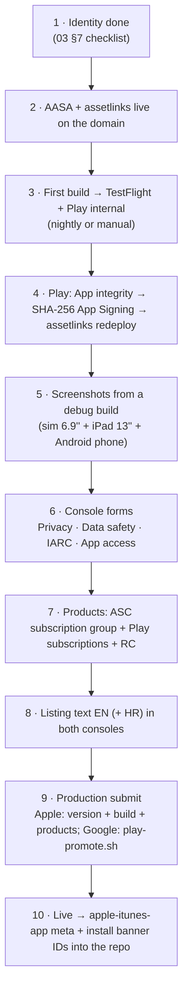

# 05 — Launching on the App Store and Google Play

*Checklists for a new application, derived from what DOMOVINA.ai already went
through (`docs/mobile-release-pipeline.md`, `docs/release-mobile.md`,
`docs/payments/TODO-store-launch.md`, `docs/payments/store-listing-copy.md`).*

---

## 1. What is automated, what is console-only

Store APIs **do not expose** legal and compliance declarations. That was
learned and does not change:

| ✅ API / script | ❌ Console only (manual, once) |
| :-- | :-- |
| Build, signing, upload to a test track | App Privacy (Apple) / Data safety (Google) |
| Listing text (ASC API; Play API for listing) | Content rating — IARC questionnaire |
| Screenshots (`asc-upload-screenshot.rb`; Play `edits.images`) | App access (does review need a login) |
| Icon, feature graphic | Ads declaration, Target audience |
| Bundle ID, capabilities, cert, profile | Financial features (Play) |
| Age rating, review contact (Apple) | Privacy policy URL (Play) |
| Promotion to production (`play-promote.sh`; ASC `reviewSubmissions`) | Developer agreements, banking, tax (once per account) |
| Subscription products (ASC API / Play API / RC MCP) | The first Apple subscription goes into review **with the app version** |

---

## 2. The order that works (from experience)



Step 10 is easy to forget: `web/index.html` `apple-itunes-app` and
`lib/services/app_install_banner.dart` carry an App Store ID that does not
exist until the app is created. Until it is live, **remove** the meta tag
(Safari otherwise draws an empty banner).

---

## 3. App Store — checklist

```
[ ] App record: name (≤30), subtitle (≤30), primary language en-US, SKU, category
[ ] Bundle ID with Associated Domains (+ Sign in with Apple if used)
[ ] Age rating questionnaire (DOMOVINA: 4+; Podcasterium: depends on the corpus — UGC podcasts
    with possible mature topics → consider 12+; "Unrestricted Web Access" = no)
[ ] App Review contact + demo note (the app works without login — say so)
[ ] App Privacy: Account (email), Identifiers (user ID), Purchase history (if IAP),
    Usage data if analytics is added; "Data not linked to you" for anon
[ ] Screenshots: APP_IPHONE_67 (6.9''/6.7'' — NOT APP_IPHONE_6_9), APP_IPAD_PRO_3GEN_129
    (iPad 13''), min 1 set per size; no login/account screens showing an e-mail
[ ] Subscription group + products "Ready to Submit" (equalize prices from the base)
[ ] ITSAppUsesNonExemptEncryption=false in Info.plist (already) → no export-compliance prompt
[ ] Build from TestFlight with processingState=VALID attached to the version
[ ] whatsNew: NOT on the first version (the API rejects it); mandatory from 1.0.1
[ ] Support URL, Marketing URL, Privacy Policy URL on the new domain
[ ] Submit → WAITING_FOR_REVIEW (asc-token.rb + reviewSubmissions flow from the pipeline doc)
```

A known rejection that could happen to Podcasterium and did not happen to
DOMOVINA: **Guideline 5.2.3 (Audio/Video Downloading)** and **4.2 (Minimum
Functionality)** — the app shows other people's YouTube content. DOMOVINA
passes because (a) it does not host third-party video but its own processing
plus a link to the source, (b) the YouTube embed is the official
`youtube-nocookie` iframe, never ad-stripping or stream extraction (CLAUDE.md
rule), (c) it has its own value (article, search). For a global product with
third-party podcasts the review note must **explain this explicitly**; if the
pipeline hosts MP4 copies of third-party episodes on its own CDN, that is a
rights question, not only a review one — see `06-…` §5.

---

## 4. Google Play — checklist

```
[ ] Create app: name, default language en-US, App, Free
[ ] Play App Signing ON at the first upload; upload key = new keystore
[ ] Internal testing release with the AAB; tester list
[ ] App integrity → SHA-256 App Signing cert → worker env ANDROID_SHA256 → web redeploy
[ ] Dashboard "Set up your app": Privacy policy URL, App access (no login needed),
    Ads (no), Content rating (IARC), Target audience (18+ or 13+; NOT children — otherwise
    Families policy), News app (no), COVID (no), Data safety, Government app (no),
    Financial features (no — Pinka is off; if on: "digital wallet" questions)
[ ] Store listing: icon 512, feature graphic 1024×500, ≥2 phone screenshots
    (1080×2400 works), description ≤4000, short description ≤80; locale 'en-US' (and 'hr', not 'hr-HR')
[ ] Subscriptions + in-app product; prices per country — DECISION for non-euro markets
    (DOMOVINA is only in 21 eurozone countries because Play requires an explicit price)
[ ] Android TV: a Leanback listing requires TV screenshots (1920×1080) and a TV banner;
    TV review is separate — "Android TV" checkbox in Advanced settings → Form factors
[ ] Production: play-promote.sh <versionCode> production "notes"
```

**Android TV** is optional for the first Podcasterium release, but the app
already supports it (same APK, `LEANBACK_LAUNCHER`). If the TV form factor is
declared, Google runs a separate TV review with its own requirements (D-pad
navigation without touch, no unsupported permissions). DOMOVINA passes it.

---

## 5. Listing copy — rules

The canonical text lives in the repo (`docs/payments/store-listing-copy.md`
for DOMOVINA), the console is a copy. Same principle for Podcasterium:
`docs/store-listing-copy.md` in the fork, EN primary.

What the DOMOVINA text **must not** carry into Podcasterium (from
`podcasterium_b2c_product.md` §8):

| ❌ | ✅ |
| :-- | :-- |
| "Catholic", "Croatian", "Magisterium", "alignment with doctrine" | "AI article by chapter", "knows who is speaking", "search by meaning" |
| "fact-checking" | — (the score does not exist in Podcasterium) |
| "works for podcasts in any language" | while the pipeline writes HR: do not promise; the phase-1 listing must be honest about the corpus |
| "send us your RSS" | self-service does not exist |
| user numbers | there are no verified ones |

Plus benefits today: **two** (30 instead of 12 search results, a badge) —
the paywall and the listing must say that, nothing more. Lesson from July
2026: the paywall listed seven benefits, two existed, and everything had to
be walked back.

---

## 6. Screenshots

Procedure from `mobile-release-pipeline.md`:
- iOS Simulator iPhone 16 Pro Max (1320×2868) and iPad 13'' (2064×2752),
  debug build, `simctl status_bar override` for a clean status bar.
- Android physical device or emulator 1080×2400 via `adb`, systemui demo mode.
- Logged-out state; no e-mail addresses.
- Curated sets in `store-assets/<brand>/{ios-iphone,ios-ipad,android,play-graphics}/`.

For Podcasterium: the 7 DOMOVINA screenshots have an order worth repeating
(home carousel → **[Magisterium → replace: person hub]** → player with
chapters → article → search → channels → channel detail). Screenshot
`02-magisterium-ai.png` has no 1:1 replacement — the proposal is the person
hub ("speaks / is mentioned"), because that is the differentiator that remains.

**Current set (24 Sep 2026)** — `store-assets/{ios-iphone,ios-ipad}/`,
01-home, 02-player, 03-article, 04-search, 05-person, 06-channel. Built
around the DOMOVINA TV channel (`/c/domovina-tv`), whose host is the owner,
so no third party appears on a person page without consent: player and
English article of `fO7iltytw0I`, the person page `/p/matija-stepanic`, a
keyword search for "liberland" with the DOMOVINA TV episode on top. Android
has its own captures in `store-assets/android/` since 25 Sep 2026.

**Procedure — `scripts/store-screenshots.sh`.** One command captures all
three devices and renders the frames; every screen is reached by URL, so no
step taps or types, and a rerun produces the same set:

```bash
./scripts/store-screenshots.sh                 # iphone, ipad, android + render
./scripts/store-screenshots.sh android         # any of: iphone ipad android
SKIP_BUILD=1 SKIP_RENDER=1 ./scripts/store-screenshots.sh iphone
```

| File | Route | What makes it deterministic |
| :-- | :-- | :-- |
| 01-home | `/` | `HERO_PIN=oxq1U0xypu8` leads the carousel and stops it rotating; captured last, so "Continue listening" holds the episode played before |
| 02-player | `/v/fO7iltytw0I/en?t=44&video=1` | `video=1` opens the video panel on every width, the iPad too (core, 26 Sep 2026); `t=44` selects the first chapter |
| 03-article | `/v/fO7iltytw0I/en?t=44&video=0` | `video=0` keeps the panel closed; `t=44` scrolls the article to the first chapter |
| 04-search | `/search?q=liberland` | `q` fills the field and runs the search without focus, so no keyboard |
| 05-person | `/p/matija-stepanic` | |
| 06-channel | `/c/domovina-tv` | |

The routes, the pinned episode and the per-screen waits live at the top of
the script. What it does per device:

- **iOS** (iPhone 17 Pro Max 1320×2868, iPad Pro 13-inch (M5) 2064×2752):
  debug simulator build with the `.env` keys plus `HERO_PIN`, reinstall
  (signed out, empty history), `simctl status_bar override` to 9:41, then
  `simctl openurl https://podcasterium.com/<route>` — a universal link, the
  live AASA covers every route — and `simctl io screenshot`.
- **Android** (AVD `podcasterium_shots`, Pixel 7 profile 1080×2400, API 35,
  booted headless when not running): debug APK, reinstall, SystemUI demo mode
  (9:41, full battery and signal, no notifications), then
  `am start -d com.podcasterium://podcasterium.com/<route> -p com.podcasterium`.
  The custom scheme, because the https App Links allow-list has no `/search`
  and a debug build is not verified for the domain.
- `HERO_PIN` is set only here. Every real build leaves it empty, and core
  `HomeFeed.pickFeaturedCarousel` then ignores it (covered by
  `featured_channels_test.dart`).

It doubles as a regression test: a route that stops resolving or a screen
that changes shows up as a diff in `store-assets/`. Its first run on
26 Sep 2026 caught two core bugs: `?video=0` reused the open player page
(same page key), and the search field had `autofocus: true`, so the keyboard
covered the results.

**Known gap — Android player video is black.** In the emulator, media_kit's
video surface stays black in every capture (`screencap` and the emulator
console, with the host and with the software GPU). `store-assets/android/02-player.jpg` therefore
shows a black video, and the committed
`marketing/out/android/02-player.jpg` is still the 24 Sep 2026 frame built
from the iPhone capture. A physical Android phone over `adb` would close the
gap; the script works with any `adb` device.

One-time setup of the AVD (the system image is ~1.5 GB; on the build Mac
`sdk/system-images` links to `/Volumes/DOMOVINA1TB/android/system-images` and
the AVD lives in `/Volumes/DOMOVINA1TB/android/avd`, because the internal
disk is nearly full). Nothing in an AVD is worth keeping: when it breaks or
has to move, delete it and recreate it with these commands rather than
copying it (a sparsebundle on the external disk copied at ~6 MB/s):

```bash
sdkmanager "system-images;android-35;google_apis;arm64-v8a"
avdmanager create avd -n podcasterium_shots -d pixel_7 \
  -k "system-images;android-35;google_apis;arm64-v8a" \
  -p /Volumes/DOMOVINA1TB/android/avd/podcasterium_shots.avd
# then in the AVD's config.ini: disk.dataPartition.size=6G, hw.ramSize=4096
```

The script boots it headless with `-gpu host`. A cold boot takes ~16 s from
`DOMOVINA1TB`; from the old `DOMOVINA_BUILD` sparsebundle it took 17 min.

**Captioned store frames** — `store-assets/marketing/`: an HTML/CSS page
(`page.html`) with captions in `frames.js`, rendered by headless Chromium
(`render.mjs`, Playwright) into `out/{iphone,ipad,android}/`, 1320×2868,
2064×2752 and 1080×1920 JPEGs. These, not the raw captures, are what gets
uploaded. iPhone and iPad render as one wide panorama cut into frames, so
the amber ribbon joins across neighbouring screenshots on the App Store;
Android renders frame by frame, because Play shows screenshots with gaps.

```bash
cd store-assets/marketing && npm install && npm run render
# reuse a cached Chromium instead of downloading one:
CHROMIUM_PATH=~/Library/Caches/ms-playwright/chromium_headless_shell-1223/chrome-headless-shell-mac-arm64/chrome-headless-shell npm run render
```

Caption rules: every claim visible in the app, counts rounded down only,
no other store or platform named (App Store guideline 2.3.10), no "#1",
"best", "free" or prices (Play metadata policy).

---

## 7. Compliance documents that need the new domain

| Document | DOMOVINA | Podcasterium |
| :-- | :-- | :-- |
| Privacy policy | `/privacy` route (`screens/legal/privacy_screen.dart`) + `docs/compliance/privacy-policy-hr.md` | EN version; same operator if ITalk; remove Certilia/OIB/voting paragraphs; add RevenueCat, Supabase, Cloudflare, Google Fonts as processors |
| Terms | `/terms` | EN; without Pinka/payout paragraphs while they are off |
| Data protection | `docs/compliance/data-protection.md` | update the subsystem list |
| KYC strategy | `docs/compliance/kyc-strategy-and-extensibility.md` | not relevant while ownership/payout is off |

Google OAuth **branding verification** (for "Sign in with Google" without the
"unverified app" warning) requires a home page that clearly explains what the
app does + a privacy link in the DOM — that is why `web/index.html` has the
HTML boot-intro and a permanent legal footer. For the new domain the
verification is **repeated**; it took DOMOVINA weeks, so start right after the
web deploy.

---

## 8. Secrets — where they live, what is backed up

| Secret | Location | Backup |
| :-- | :-- | :-- |
| ASC API `.p8` | `~/.appstoreconnect/private_keys/AuthKey_<id>.p8` | offsite, 2 places — not regenerable |
| Android upload keystore | `android/upload-keystore.jks` (gitignored) + `key.properties` | offsite, 2 places — loss = Play support reset |
| Play service account JSON | `~/.config/play-publisher/*.json` | regenerable in GCP |
| Cloudflare purge token, zone id | `.env` | regenerable |
| Supabase anon key | `.env` → `--dart-define` | public by design, but rotation discipline |
| RC public SDK keys | `.env` | public |
| Telegram bot token | `.env` | regenerable; **never** straight to the Telegram API — through `telegram-notify.rb` |

Never in the repo. Never on Desktop/Downloads (a July TODO that still holds).

---

## 7. Measured while filling the Podcasterium records (23–24 Sep 2026)

What the first pass through both consoles taught, so the next brand does not
rediscover it. State of the records themselves: `03-…` §8.

**Google Play**

- A brand-new app **accepts its first AAB through the Developer API** when
  the track release is `status: draft`. A second edit then sets it to
  `completed` on `internal`. No console upload was needed, contrary to the
  common advice.
- The App Signing page now shows a "Classical" and a "Post-quantum" key; the
  fingerprints are only reachable through the copy buttons. `assetlinks.json`
  takes the **Classical** SHA-256, plus the upload key for sideloaded builds.
- All ten App content declarations are console-only. The IARC questionnaire
  answers that mirror Apple's 12+ (mild, spoken-only violence, language and
  drug references; online content yes) produced ESRB Teen, PEGI 3, USK 12.
- "Send for review" stays locked until the store graphics exist; internal
  testing works without it.

**App Store Connect**

- The API covers listing text, URLs, categories, the age-rating declaration,
  price (`appPriceSchedules`, free point in `USA`), availability
  (`POST /v2/appAvailabilities` with every territory, then mainland China
  switched off because it needs an ICP filing), App Review details, the
  content-rights declaration and attaching a build.
- It does **not** cover App Privacy, Sign in with Apple grouping, or adding an
  internal TestFlight tester (`POST /betaTesters` returns 500, adding an
  existing tester to the group returns 409). All three were done in the
  browser.
- The version record the console creates is `1.0`; it was renamed to `1.0.0`
  so it matches `CFBundleShortVersionString`.

**First production submission (24 Sep 2026)**

- A subscription stays `MISSING_METADATA`, and the console refuses "Add for
  Review" with *"You must add a subscription price"*, until it has a price in
  **every** territory, including mainland China where the app is not sold.
  DOMOVINA has 175 prices; Podcasterium had 174 until the CHN price was added.
- The first subscriptions go through a *draft submission*: each subscription,
  the subscription group and the app version are added to the same draft,
  then "Submit for Review". The version page shows no in-app purchase section
  in the current console.
- Play: while the app is a *draft app*, the API accepts a production release
  only with `status: draft`. Countries (177, "rest of world" included) and
  "Send for review" are console steps; quick checks run for up to 14 minutes
  before the review starts.
- Play screenshots were the iPhone captures cropped to 2:1 without the iOS
  status bar; the local emulator had no system image installed.

**Building the shell**

- The upstream `main` checkout has no `packages/podcast_core`; the core lives
  on `feat/podcast-core`. The shell was built from a worktree of that branch
  (`../domovinatv/.podcast-core`), pointed at by the git-ignored
  `pubspec_overrides.yaml`.
- The iOS project still had `flutter create` defaults (foreign team, no
  entitlements, no URL scheme); fixed in commit `5dc4c50`. Build 1.0.0 (2)
  took 93 s to archive and was `VALID` about 3.5 minutes after upload.
