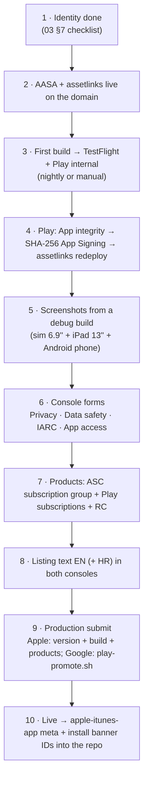

# 05 — Launching on the App Store and Google Play

*Checklists for a new application, derived from what DOMOVINA.ai already went
through (`docs/mobile-release-pipeline.md`, `docs/release-mobile.md`,
`docs/payments/TODO-store-launch.md`, `docs/payments/store-listing-copy.md`).*

---

## 1. What is automated, what is console-only

Store APIs **do not expose** legal and compliance declarations. That was
learned and does not change:

| ✅ API / script | ❌ Console only (manual, once) |
| :-- | :-- |
| Build, signing, upload to a test track | App Privacy (Apple) / Data safety (Google) |
| Listing text (ASC API; Play API for listing) | Content rating — IARC questionnaire |
| Screenshots (`asc-upload-screenshot.rb`; Play `edits.images`) | App access (does review need a login) |
| Icon, feature graphic | Ads declaration, Target audience |
| Bundle ID, capabilities, cert, profile | Financial features (Play) |
| Age rating, review contact (Apple) | Privacy policy URL (Play) |
| Promotion to production (`play-promote.sh`; ASC `reviewSubmissions`) | Developer agreements, banking, tax (once per account) |
| Subscription products (ASC API / Play API / RC MCP) | The first Apple subscription goes into review **with the app version** |

---

## 2. The order that works (from experience)



Step 10 is easy to forget: `web/index.html` `apple-itunes-app` and
`lib/services/app_install_banner.dart` carry an App Store ID that does not
exist until the app is created. Until it is live, **remove** the meta tag
(Safari otherwise draws an empty banner).

---

## 3. App Store — checklist

```
[ ] App record: name (≤30), subtitle (≤30), primary language en-US, SKU, category
[ ] Bundle ID with Associated Domains (+ Sign in with Apple if used)
[ ] Age rating questionnaire (DOMOVINA: 4+; Podcasterium: depends on the corpus — UGC podcasts
    with possible mature topics → consider 12+; "Unrestricted Web Access" = no)
[ ] App Review contact + demo note (the app works without login — say so)
[ ] App Privacy: Account (email), Identifiers (user ID), Purchase history (if IAP),
    Usage data if analytics is added; "Data not linked to you" for anon
[ ] Screenshots: APP_IPHONE_67 (6.9''/6.7'' — NOT APP_IPHONE_6_9), APP_IPAD_PRO_3GEN_129
    (iPad 13''), min 1 set per size; no login/account screens showing an e-mail
[ ] Subscription group + products "Ready to Submit" (equalize prices from the base)
[ ] ITSAppUsesNonExemptEncryption=false in Info.plist (already) → no export-compliance prompt
[ ] Build from TestFlight with processingState=VALID attached to the version
[ ] whatsNew: NOT on the first version (the API rejects it); mandatory from 1.0.1
[ ] Support URL, Marketing URL, Privacy Policy URL on the new domain
[ ] Submit → WAITING_FOR_REVIEW (asc-token.rb + reviewSubmissions flow from the pipeline doc)
```

A known rejection that could happen to Podcasterium and did not happen to
DOMOVINA: **Guideline 5.2.3 (Audio/Video Downloading)** and **4.2 (Minimum
Functionality)** — the app shows other people's YouTube content. DOMOVINA
passes because (a) it does not host third-party video but its own processing
plus a link to the source, (b) the YouTube embed is the official
`youtube-nocookie` iframe, never ad-stripping or stream extraction (CLAUDE.md
rule), (c) it has its own value (article, search). For a global product with
third-party podcasts the review note must **explain this explicitly**; if the
pipeline hosts MP4 copies of third-party episodes on its own CDN, that is a
rights question, not only a review one — see `06-…` §5.

---

## 4. Google Play — checklist

```
[ ] Create app: name, default language en-US, App, Free
[ ] Play App Signing ON at the first upload; upload key = new keystore
[ ] Internal testing release with the AAB; tester list
[ ] App integrity → SHA-256 App Signing cert → worker env ANDROID_SHA256 → web redeploy
[ ] Dashboard "Set up your app": Privacy policy URL, App access (no login needed),
    Ads (no), Content rating (IARC), Target audience (18+ or 13+; NOT children — otherwise
    Families policy), News app (no), COVID (no), Data safety, Government app (no),
    Financial features (no — Pinka is off; if on: "digital wallet" questions)
[ ] Store listing: icon 512, feature graphic 1024×500, ≥2 phone screenshots
    (1080×2400 works), description ≤4000, short description ≤80; locale 'en-US' (and 'hr', not 'hr-HR')
[ ] Subscriptions + in-app product; prices per country — DECISION for non-euro markets
    (DOMOVINA is only in 21 eurozone countries because Play requires an explicit price)
[ ] Android TV: a Leanback listing requires TV screenshots (1920×1080) and a TV banner;
    TV review is separate — "Android TV" checkbox in Advanced settings → Form factors
[ ] Production: play-promote.sh <versionCode> production "notes"
```

**Android TV** is optional for the first Podcasterium release, but the app
already supports it (same APK, `LEANBACK_LAUNCHER`). If the TV form factor is
declared, Google runs a separate TV review with its own requirements (D-pad
navigation without touch, no unsupported permissions). DOMOVINA passes it.

---

## 5. Listing copy — rules

The canonical text lives in the repo (`docs/payments/store-listing-copy.md`
for DOMOVINA), the console is a copy. Same principle for Podcasterium:
`docs/store-listing-copy.md` in the fork, EN primary.

What the DOMOVINA text **must not** carry into Podcasterium (from
`podcasterium_b2c_product.md` §8):

| ❌ | ✅ |
| :-- | :-- |
| "Catholic", "Croatian", "Magisterium", "alignment with doctrine" | "AI article by chapter", "knows who is speaking", "search by meaning" |
| "fact-checking" | — (the score does not exist in Podcasterium) |
| "works for podcasts in any language" | while the pipeline writes HR: do not promise; the phase-1 listing must be honest about the corpus |
| "send us your RSS" | self-service does not exist |
| user numbers | there are no verified ones |

Plus benefits today: **two** (30 instead of 12 search results, a badge) —
the paywall and the listing must say that, nothing more. Lesson from July
2026: the paywall listed seven benefits, two existed, and everything had to
be walked back.

---

## 6. Screenshots

Procedure from `mobile-release-pipeline.md`:
- iOS Simulator iPhone 16 Pro Max (1320×2868) and iPad 13'' (2064×2752),
  debug build, `simctl status_bar override` for a clean status bar.
- Android physical device or emulator 1080×2400 via `adb`, systemui demo mode.
- Logged-out state; no e-mail addresses.
- Curated sets in `store-assets/<brand>/{ios-iphone,ios-ipad,android,play-graphics}/`.

For Podcasterium: the 7 DOMOVINA screenshots have an order worth repeating
(home carousel → **[Magisterium → replace: person hub]** → player with
chapters → article → search → channels → channel detail). Screenshot
`02-magisterium-ai.png` has no 1:1 replacement — the proposal is the person
hub ("speaks / is mentioned"), because that is the differentiator that remains.

---

## 7. Compliance documents that need the new domain

| Document | DOMOVINA | Podcasterium |
| :-- | :-- | :-- |
| Privacy policy | `/privacy` route (`screens/legal/privacy_screen.dart`) + `docs/compliance/privacy-policy-hr.md` | EN version; same operator if ITalk; remove Certilia/OIB/voting paragraphs; add RevenueCat, Supabase, Cloudflare, Google Fonts as processors |
| Terms | `/terms` | EN; without Pinka/payout paragraphs while they are off |
| Data protection | `docs/compliance/data-protection.md` | update the subsystem list |
| KYC strategy | `docs/compliance/kyc-strategy-and-extensibility.md` | not relevant while ownership/payout is off |

Google OAuth **branding verification** (for "Sign in with Google" without the
"unverified app" warning) requires a home page that clearly explains what the
app does + a privacy link in the DOM — that is why `web/index.html` has the
HTML boot-intro and a permanent legal footer. For the new domain the
verification is **repeated**; it took DOMOVINA weeks, so start right after the
web deploy.

---

## 8. Secrets — where they live, what is backed up

| Secret | Location | Backup |
| :-- | :-- | :-- |
| ASC API `.p8` | `~/.appstoreconnect/private_keys/AuthKey_<id>.p8` | offsite, 2 places — not regenerable |
| Android upload keystore | `android/upload-keystore.jks` (gitignored) + `key.properties` | offsite, 2 places — loss = Play support reset |
| Play service account JSON | `~/.config/play-publisher/*.json` | regenerable in GCP |
| Cloudflare purge token, zone id | `.env` | regenerable |
| Supabase anon key | `.env` → `--dart-define` | public by design, but rotation discipline |
| RC public SDK keys | `.env` | public |
| Telegram bot token | `.env` | regenerable; **never** straight to the Telegram API — through `telegram-notify.rb` |

Never in the repo. Never on Desktop/Downloads (a July TODO that still holds).
