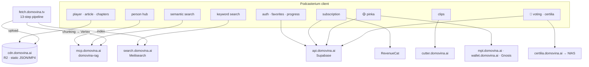

# 06 — Backend and corpus: what Podcasterium shares, what it switches off, where the real cost is

*The client is 3.5 % domain-bound. This document is about the remaining
96.5 % that work — but over **Croatian** content, with a backend that is not
in the client repo.*

---

## 1. Map of the client's dependencies



**Phase 1 Podcasterium targets all of the same.** That is deliberate: it
proves the build, identity, stores and brand — not the corpus.

### 1.1 Two things change, not one

What is **switched off** (§3) — and, found on the first web deploy, **the
browser origin**. Every shared service that a browser calls directly has a
CORS allow-list built for `https://domovina.ai`, and `https://podcasterium.com`
is not in it.

Measured 21 Sep 2026:

```bash
curl -sD - -o /dev/null -H 'Origin: https://domovina.ai'     https://mcp.domovina.ai/api/persons | grep -i access-control-allow-origin
# access-control-allow-origin: https://domovina.ai
curl -sD - -o /dev/null -H 'Origin: https://podcasterium.com' https://mcp.domovina.ai/api/persons | grep -i access-control-allow-origin
# (nothing — the browser then fails the fetch)
```

In the running app that surfaces as
`PersonService: error on /api/persons: ClientException: Failed to fetch`, and
the person hub stays empty on the web. The response itself is a 200; only the
header is missing, so `curl` without an `Origin` sees nothing wrong — which is
why this did not show up until a browser loaded the app.

Not affected: the worker's own `PERSON_API`/`PERSONS_API` calls, which are
server-side, so SSR `/p/*` pages and the sitemap work. Not yet checked the
same way: `search.domovina.ai` (Meilisearch) and `cutter.domovina.ai`.

The fix belongs with the shared backends, next to the GoTrue redirect
allow-list (`03-…` §5): every origin allow-list learns the new domain. On
Android and iOS there is no origin, so the native apps never saw this.

---

## 2. CDN contract — what the client expects

Centralized in `lib/services/cdn_config.dart`; format in
`fetch.domovina.tv/docs/data_contract.md`.

| Path | Required | Podcasterium |
| :-- | :-- | :-- |
| `/channels/data/index.json`, `/channels/data/<id>.json` | yes | same |
| `/channels/images/<id>/avatar_{square,cover}.jpg` | — | same |
| `/data/<ytId>/info.json` | **yes** (the only required one) | same |
| `/data/<ytId>/{summary,outline,article}.json` | no | same |
| `/data/<ytId>/article.magisterium*.json` (5 variants + 2 prompts) | no | **not fetched** when `flags.domainScore=false` |
| `/data/<ytId>/*.en.json` | no | same |
| `/data/<ytId>/diarized.srt` | no | same |
| `/data/<ytId>/{video_h264.mp4, audio.mp3, video.mp4}` | one | same; the `resolveMedia()` probe order stays |
| `/images/<ytId>/thumbnail.png`, `thumb-{320,640,1280}.webp`, `screenshots/` | — | same |

The contract is brand-neutral. `_source: "x"` and `_yt_matched: false` in
`info.json` show that the input is already not YouTube-only (X posts,
beamly/transistor audio). **RSS ingestion does not exist** — zero hits in the
client, not in the pipeline. For a global product that is the first backend
requirement (§5).

Cache rules the client assumes and a new CDN must repeat: everything
immutable except channel listings (the client adds `?v=<epoch/300000>`); the
CDN caches 404s for four hours → probe URLs carry a cache-buster.

---

## 3. Feature flags — what is switched off and where the entry points are

| Flag | Default DOMOVINA | Podcasterium p1 | Entry points that get gated |
| :-- | :-- | :-- | :-- |
| `certilia` | on | **off** | `auth_sheet.dart:274` (provider list), `auth_service.dart` (`signInWithCertilia`), `certilia_service.dart`; `pubspec` path dependency → git or removed |
| `voting` | on | **off** | `app_router.dart` routes `/glasanje*`, `home_screen.dart` + `home_app_bar.dart` (voting rail, entry), `account_screen.dart`, `all_channels_screen.dart`, `nav.dart`; worker AASA/intent filter entries |
| `pinka` | on | **off** (p1) | `support_episode_panel.dart`, `pinka_support_bar.dart` in `bottomNavigationBar`, `channel_screen.dart` support wall, routes `/c/:slug/doniraj`, `/account/channels/…/campaigns`; SEPA is eurozone — global needs a Stripe rail |
| `channelOwnership` | on | **off** (p1) | `/c/:slug/claim`, `/youtube-claim/callback`, `/account/channels`, KYC with OIB, Safe multisig; depends on Pinka payouts |
| `domainScore` | on (Magisterium) | **off** | `data_service.dart` Magisterium fetches, `home_feed.dart` ranker, `sort_mode.dart`, badges (fall back on `hasMagisterium=false` by themselves) |
| `calBooking` | on | **off** | `founder_booking.dart` ("15 min with the founder"), worker `/api/cal/*` |
| `handoff` | on | on | brand-neutral |
| `tv` | on | on | brand-neutral; Leanback listing optional |

Flags are **compile-time** (`const` from `BrandConfig`) so tree-shaking drops
the code and no runtime path to a disabled feature exists. No remote config
needed.

What is **not** switched off even though it sounds Croatian:
`episode_language.dart` (HR/EN content switch) — stays while the corpus has
an EN overlay; `LocaleController` gets default `en`.

---

## 4. Supabase — shared, with consequences

Tables the client touches (from `grep .from(`): `favorites`, `watch_progress`,
`v_continue_watching`, `subscriptions`, `accounts`, `campaigns`,
`contributions`, `public_contributions`, `public_slots`, `slot_maps`,
`slot_zones`, `owner_wallets`, `payouts`, `episode_safes`, `safe_actions`,
`channel_claims`, `yield_positions`; RPCs `migrate_anon_data`,
`create_handoff_token`. With the flags off Podcasterium touches **the first five**.

Consequences of sharing (details in `03-…` §5): the same `auth.users`, the
same favorites for a user who signs in to both apps, one GoTrue e-mail
template, one `SITE_URL`. All acceptable in phase 1. When the corpora
diverge, `favorites.youtube_id` may point at an episode the other corpus
does not have — `favorites_resolver.dart` already treats that as
"unavailable", but it needs a test.

**Phase 2 decision**: a separate Supabase project for Podcasterium (same
`domovina-api` schema, another instance) or an `app_id` column in the user
tables. A separate project is simpler and cleaner for GDPR (different
operators/regions); `domovina-api` already has migrations, so bringing up a
second instance on Coolify is a repeatable job.

---

## 5. The real cost of a global product — not in the client

This is the most important section of the document and repeats the August
conclusion because nothing has changed:

### 5.1 Pipeline output language

`generate_article_gemini.js` writes the article, summary, topics and speaker
names **in Croatian** regardless of the audio language. An English podcast
gets a Croatian article. Podcasterium with English users has nothing to show
until the pipeline writes in the source language (or in the language the
user chooses).

What that requires: a prompt change (small), source-language detection
(whisper already knows it), **re-processing the corpus** that is to be offered
globally (LLM cost × minutes). The first step from August still stands: **one
Sub Club episode through the pipeline with an English article**, comparison,
measurement of € and minutes per hour of processing per step.

### 5.2 Multi-tenant / self-service ingestion

The pipeline is 13 steps with manual rclone syncs and a local Metal Mac for
ASR. "Enter your channel" does not exist. RSS input does not exist. For a
global product that is a **project**, not a task — and it is not in this repo.

### 5.3 Content rights

DOMOVINA hosts `video_h264.mp4` / `audio.mp3` copies of episodes on its own
R2. For Croatian channels with an existing relationship that is agreed ("if
the author asks, we remove it"). For "every podcast in the world", hosting
copies is a different legal question. An alternative the client **already
supports**: YouTube embed mode (`youtube_embed.dart`, official
`youtube-nocookie` iframe, web-only) and audio-only from the original feed.
The decision affects Apple review (5.2.3) and CDN cost; make it before phase 2.

### 5.4 Semantic search and person hub

`domovina-rag` indexes Croatian chunks in Vertex; person hub slugs are
ASCII-folded Croatian names. For another language the same principle works,
but the index is per corpus — another backend job per tenant.

---

## 6. What phase 1 may promise

The first Podcasterium version is **a white-label DOMOVINA.ai without the
domain features**: the same (Croatian) corpus, new brand, new identities, EN
interface. That is legitimate as:
- proof of the pipeline and the stores,
- the technical base onto which phase 2 brings its own corpus,
- an internal/TestFlight product.

It **is not** "the global app for every podcast". The listing, the landing
page and the outreach must say so (`podcasterium_b2c_product.md` §2 and §8
apply verbatim).
