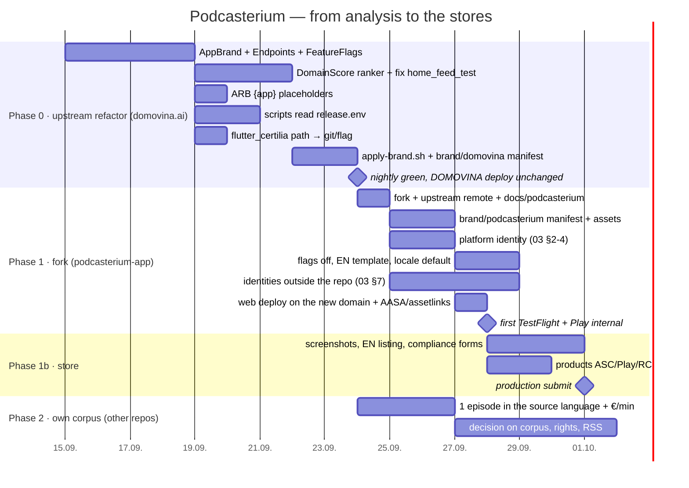

# 07 — Roadmap and estimates

*Estimates are in working days of one developer who knows the codebase. They
are labelled as estimates — the only thing in this document series that is
not measured.*

---

## 0. Decisions that block the start (not engineering)

| # | Decision | Who | Blocks |
| :-- | :-- | :-- | :-- |
| D1 | Domain | owner | everything in 03 |
| D2 | Bundle ID / applicationId | owner | everything in 03 |
| D3 | Apple team: same (ITalk) or new | owner | ASC, RC, AASA |
| D4 | Colours, logo, wordmark | owner + design | brand manifest |
| D5 | Strategy C (fork + upstream) confirmed | owner | order of phases |
| D6 | Legal entity / operator in the footer and stores | owner | legal texts |
| D7 | Pricing for non-euro markets (or euro-only start) | owner | Play products |

---

## 1. Phases



### Phase 0 — upstream refactor (≈ 12–15 days)

All in `domovina.ai`, all without behaviour change, all through the nightly gate.

| Task | Days | What "done" means |
| :-- | --: | :-- |
| `lib/brand/`: `BrandConfig`, `Endpoints`, `FeatureFlags`, `domovinaBrand`; replacement across 81 files (name, hosts, scheme, store ID, entitlement, colours `croBlue/croRed → brandPrimary/brandAccent`) | 4 | the `grep` from `02-…` §5 returns 0 outside `lib/brand/` |
| `DomainScoreProvider` + `home_feed.dart` ranker with a `score == null` branch; fix `home_feed_test.dart`; `sort_mode` gated | 3 | `flutter test` passes home_feed; the hero on DOMOVINA picks the same as before |
| ARB: 26 keys with "DOMOVINA" → `{app}` | 1 | `grep -c DOMOVINA app_en.arb` = 0 |
| `release.env` + `source` in 6 scripts + launchd template | 2 | `BRAND=domovina ./scripts/deploy.sh` identical to today's |
| `flutter_certilia`: git dependency or conditional import behind a flag | 1 | a fresh clone passes `pub get` |
| `apply-brand.sh` + `brand/domovina/brand.yaml`; generates icons, splash, manifest, colors, index.html meta | 2 | idempotent: `git status` clean after a second run |
| Worker: constants → `env.X ?? default`; AASA/assetlinks from env; flag for voting/cal/airkuna blocks | 1 | the production worker without env is identical to today's |
| Reserve for what will break (web fonts, TV, auth return path) | 2 | — |

Risk: medium. The largest is `home_feed` (the only test is failing) and the
22 share URL sites (each was hand-written for a reason). Mitigation: one PR
per table row, each through the nightly.

### Phase 1 — fork and first build (≈ 8–10 engineering days + waiting for external accounts)

| Task | Days | Note |
| :-- | --: | :-- |
| Fork, `upstream` remote, docs into `docs/podcasterium/` | 0.5 | `01-…` §6 |
| `brand/podcasterium/` manifest + logo/icon/OG/banner/splash taglines | 2 | blocked by D4 |
| Platform identity: gradle, Kotlin package, manifest, pbxproj, Info.plist, entitlements, xcconfig, wrangler | 2 | `03-…` §2–4; mechanical but ≈ 25 files |
| Flags off + deleting the red bucket if desired; `l10n.yaml` EN template; locale/episode language default | 2 | the fork may delete |
| External identities (ASC app, Play app, keystore, OAuth, RC, Pages, zone) | 4 | mostly waiting; `03-…` §7 |
| Web deploy + AASA/assetlinks verification; first AAB/IPA; TestFlight + Play internal | 1 | `04-…` §8 commands |

Risk: low in code, **medium in accounts** (Google branding verification, the
Play App Signing SHA known only after upload, Apple AASA cache).

### Phase 1b — store launch (≈ 5 days + review)

Screenshots (1), console forms (1), ASC/Play/RC products (2), EN listing (1),
submit. Apple review typically 1–3 days, Google 1–7; the first Apple
subscription goes with the version.

### Phase 2 — own corpus (other repos; not estimated)

Not in this repo and not needed for phase 1. The first measurable step is
three days: one English episode through the pipeline with an English article,
and the measured cost per hour of processing per step. Only with that number
does estimating the rest make sense (`06-…` §5).

---

## 2. Total to the first standalone build on both stores

| | Engineering days | Calendar (with waiting for accounts and review) |
| :-- | --: | :-- |
| Phase 0 | 12–15 | 3 weeks |
| Phase 1 | 8–10 | 2–3 weeks (overlaps with 0 for accounts) |
| Phase 1b | 5 | 1–2 weeks + review |
| **Total** | **25–30** | **≈ 6–8 weeks** |

Compared with the August estimate (17–29 days for the frontend): the same
size, distributed differently — there DomainScore was 6–10 days because it
included renaming 39 files; here it is 3 because the renaming is not done.
Days were added here for scripts, the worker and platform identity, which the
August analysis did not count.

---

## 3. Definition of "done" for phase 1

```
[ ] https://<domain>/ serves the Podcasterium build, 200, no DOMOVINA string in the DOM
    (curl -s https://<domain>/ | grep -ci domovina → 0)
[ ] /.well-known/apple-app-site-association and assetlinks.json carry the new appID/package
[ ] TestFlight build under the new bundle ID, processingState=VALID
[ ] Play internal track under the new applicationId
[ ] App Links verified: adb shell pm get-app-links <package> → verified
[ ] Universal link opens the app on an iOS device (not the simulator)
[ ] Google/Apple/e-mail/passkey sign-in works on web + iOS + Android with the new scheme
[ ] Paywall shows products from the new RC project (sandbox purchase passes)
[ ] flutter test in the fork: same or better than upstream
[ ] git merge upstream/main passes without conflicts in lib/ outside lib/brand/
[ ] DOMOVINA.ai nightly green, production unchanged (version, hero pick, AASA)
```

---

## 4. Risks and how to see them early

| Risk | Signal | Mitigation |
| :-- | :-- | :-- |
| Phase 0 changes DOMOVINA.ai behaviour | nightly red; different hero; different share link | PR per row; `home_feed_test` before the ranker; snapshot share URLs before/after |
| Merging from upstream starts to hurt | conflicts outside `lib/brand/` | the fork does not touch `lib/` except brand in phase 1; larger changes go upstream behind a flag |
| Google branding verification is late | "unverified app" screen | deploy the web with boot-intro and privacy link on day one of phase 1 |
| Apple 5.2.3 / 4.2 rejection | review message | review note about own processing + link to source; do not host copies without agreement (`06-…` §5.3) |
| Two nightlies on the same Mac | both late / Xcode lock | different times, own DerivedData |
| A user with the same Google account sees DOMOVINA favorites in Podcasterium | "where did this come from" | phase 1: acceptable and documented; phase 2: separate Supabase |
| The corpus is Croatian, the listing promises global | bad reviews | the listing tells the truth (`05-…` §5) |

---

## 5. What NOT to do

- Do not rewrite in another stack (`docs/tech-stack-assessment-flutter-vs-expo.md`
  — the decision is permanent until the pain is existential).
- Do not do a hard fork with `sed` (`01-…` §3).
- Do not rename `Magisterium*` classes in phase 0 (a 39-file diff for zero behaviour).
- Do not change fonts in phase 1.
- Do not promise RSS, self-service, "any language", fact-checking.
- Do not copy the DOMOVINA keystore for Podcasterium.
- Do not put the `apple-itunes-app` meta in until the app is live.
- Do not write Croatian into this repository (`CLAUDE.md`).
