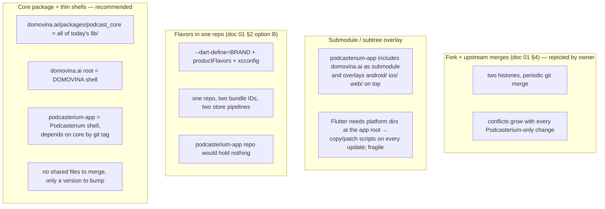

# 08 — White-label architecture: core package + thin app shells

*Supersedes the recommendation in `01-strategy-fork-vs-flavor.md` §4. Written
10 Sep 2026 after the owner ruled out a fork: development continues in
`domovina.ai`, its git history keeps growing, and Podcasterium must receive
every fix and feature without a second diverging history. The question asked:
can DOMOVINA.ai be treated as the staging/development environment of
Podcasterium, and is that maintainable?*

---

## 1. Short answer

**Yes, it is feasible and it is not a maintenance disaster — on one condition:
Podcasterium must contain zero application code.** It has to be a *consumer*
of DOMOVINA.ai's code, not a *copy* of it. The moment this repository holds
its own version of any file under `lib/`, the two histories diverge and the
owner's fear comes true.

The pattern that delivers this is the standard Flutter white-label layout:

```
one core package  +  N thin app shells
```

- The **core package** (`podcast_core`) is everything that is today
  `domovina.ai/lib/`, exposed through one entry point:
  `runPodcastApp(BrandConfig brand)`.
- An **app shell** is a normal Flutter app that owns only what differs per
  product: `pubspec.yaml` (depends on the core), `lib/main.dart` (≈ 50 lines
  building a `BrandConfig`), `android/`, `ios/`, `web/`, `macos/`, brand
  assets, store assets, release config.
- `domovina.ai` becomes the first shell. `podcasterium-app` becomes the
  second. Both build from the **same** core at a pinned version.

"DOMOVINA.ai as staging for Podcasterium" is then precisely true for the core
(every player, navigation, search, auth fix ships in DOMOVINA first, with real
users, and Podcasterium picks it up by bumping one version line) — and
precisely false for identity, brand and stores (those have no shared code and
must be tested on their own TestFlight/Play internal track). Keep both halves
of that sentence in mind; §6 lists what staging does **not** cover.

---

## 2. The patterns considered



| Criterion | Fork + merge | Submodule overlay | Flavors, one repo | **Core + shells** |
| :-- | :-- | :-- | :-- | :-- |
| Git history divergence | **yes** | no (but overlay patches drift) | no | **no** |
| Podcasterium gets every core fix | by merge, with conflicts | by submodule bump, then re-apply overlay | automatically | **by version bump, no conflicts** |
| Separate public repo for Podcasterium | yes | yes | no — or an empty mirror | **yes, and it is genuinely small and readable** |
| Risk of Podcasterium change breaking DOMOVINA | low | none | **high** (same files) | none — shells cannot touch the core |
| Risk of DOMOVINA change breaking Podcasterium | found at merge time | found at bump time | found at build time | found **in DOMOVINA CI** if the shell is a CI target (§5) |
| Per-product platform dirs, bundle IDs, signing | yes | hacked | flavors + xcconfig, one Xcode project for both | **yes, native Flutter layout** |
| Refactor cost upstream | brand layer (doc 02) | brand layer | brand layer + flavor plumbing | brand layer + **package extraction** (§4) |
| Fits "DOMOVINA is staging" | partly | partly | yes, but one repo | **yes** |

Flavors and core+shells share the same prerequisite (the brand layer of
doc 02) and both avoid divergence. Core+shells wins because the owner wants a
separate, open-source Podcasterium repository, and because a package boundary
is *enforced by the compiler*: a shell physically cannot reach into core
internals that are not exported, so white-label discipline is not a code
review rule but a build error.

---

## 3. Target layout

### 3.1 `domovina.ai` (upstream, Croatian, private development pace)

```
domovina.ai/
  pubspec.yaml                 # pub workspace root (Dart ≥ 3.6; the repo is on 3.13)
  packages/
    podcast_core/              # today's lib/ + test/ + l10n, minus main.dart
      lib/podcast_core.dart    # public API: runPodcastApp(), BrandConfig, FeatureFlags
      lib/src/…                # everything else, not exported
      test/
    podcast_release/           # scripts/ + launchd templates, brand-agnostic (optional, phase B)
  apps/
    domovina/                  # the DOMOVINA shell (today's repo root)
      lib/main.dart            # ~50 lines: domovinaBrand → runPodcastApp
      android/ ios/ web/ macos/
      brand/                   # logo, splash taglines, OG, manifest (doc 02 §3)
      store-assets/
  docs/  CLAUDE.md  …
```

Moving today's root app into `apps/domovina/` is optional; the shell can stay
at the repo root with `packages/podcast_core/` beside it. Moving it is cleaner
for the workspace and for the nightly worktree, but it is a larger
`git mv`. Decide at extraction time; the recommendation below assumes the
package is extracted first and the shell moves later, if ever.

### 3.2 `podcasterium-app` (this repository, English, public)

```
podcasterium-app/
  pubspec.yaml
    dependencies:
      podcast_core:
        git:
          url: https://github.com/domovinatv/ai.domovina.tv.git   # or a public mirror
          path: packages/podcast_core
          ref: core-v1.4.0                                        # pinned tag
  lib/main.dart                # podcasteriumBrand → runPodcastApp
  lib/brand.dart               # BrandConfig for Podcasterium (doc 02 §4 decisions)
  android/ ios/ web/ macos/    # own identifiers (doc 03)
  brand/                       # logo, splash, OG, taglines
  store-assets/
  scripts/                     # thin wrappers that source release.env and call podcast_release
  docs/                        # these documents
```

The only files in this repo that are *not* configuration or assets are
`lib/main.dart` and `lib/brand.dart`. That is the whole point.

### 3.3 What the core API has to expose

Measured on `cfb45aa`: `lib/main.dart` is imported by **39 files** (mostly for
`log` and `rootScaffoldMessengerKey`), which is exactly the coupling the
extraction has to cut. Minimal public surface:

```dart
// packages/podcast_core/lib/podcast_core.dart
export 'src/brand/brand_config.dart';      // BrandConfig, Endpoints, FeatureFlags
export 'src/app.dart' show runPodcastApp;  // Future<void> runPodcastApp(BrandConfig)
export 'src/log.dart' show log;            // moved out of main.dart
// Extension points the DOMOVINA shell needs for features Podcasterium does not ship:
export 'src/auth/auth_provider_plugin.dart';  // register Certilia as an AuthProviderPlugin
export 'src/home/rail_registry.dart';         // register the voting rail as a HomeRail
```

Everything else stays `src/` and is invisible to shells. The shell passes
brand, flags and optional plugins; the core never reads `--dart-define=BRAND`
itself (that stays an implementation detail of the DOMOVINA shell if it wants
one).

---

## 4. Migration from today's repo, in order

Each step is a behaviour-preserving PR in `domovina.ai`, gated by the
existing nightly. Estimates are estimates.

| # | Step | Days | Done when |
| :-- | :-- | --: | :-- |
| A1 | Brand layer (`BrandConfig`, `Endpoints`, `FeatureFlags`) — unchanged from doc 02, still the prerequisite | 4 | grep from doc 02 §5 returns 0 outside `lib/brand/` |
| A2 | `DomainScore` ranker with `score == null` branch; fix `home_feed_test.dart` | 3 | doc 02 §2 |
| A3 | Split `main.dart`: `log`, `appVersion`, `rootScaffoldMessengerKey` → `src/log.dart` / `src/app.dart`; `main()` becomes `runPodcastApp(domovinaBrand)` | 1 | 39 importers of `main.dart` → 0 |
| A4 | Certilia behind a plugin seam: core defines `AuthProviderPlugin`; `flutter_certilia` moves to the DOMOVINA shell's `pubspec.yaml`; the shell registers the plugin | 2 | core `pubspec.yaml` has no path dependency; fresh clone passes `pub get` |
| A5 | Voting and Pinka behind the same seam (rail registry, route registry) — or, pragmatically, keep them in core behind `FeatureFlags` for now and extract later | 0–4 | flags off → no route, no rail, no fetch |
| A6 | `git mv lib packages/podcast_core/lib`, same for `test/` and `l10n`; pub workspace in the root `pubspec.yaml`; DOMOVINA shell `lib/main.dart` depends on `podcast_core` by path | 2 | `flutter build` of the shell is byte-identical in behaviour; nightly green |
| A7 | First tag `core-v1.0.0`; Podcasterium shell in this repo depends on it by git ref; first Podcasterium build | 1 | `flutter run` here shows the HR corpus under the Podcasterium brand |
| A8 | CI job in `domovina.ai` that builds the Podcasterium shell against the PR's core (§5) | 1 | a PR that breaks the white label turns red upstream |

Total ≈ **14–18 days** upstream, replacing phase 0 of doc 07 (12–15 days).
The extra 2–3 days buy the compiler-enforced boundary and the CI tripwire.
Phases 1, 1b and 2 of doc 07 are unchanged; phase 1 gets *shorter* because
there is no fork step and no `docs/podcasterium/` move.

Platform directories are **not** shared and **not** generated from the core.
Each shell owns its `android/ ios/ web/ macos/`. When upstream changes
something native (a new permission in `AndroidManifest.xml`, a new
`UIBackgroundModes` entry, a worker route), that change must be mirrored in
the Podcasterium shell by hand. This is the one place where drift *is*
possible; §6 says how to catch it.

---

## 5. The tripwire that makes "staging" honest

A staging environment is only staging if promotion is automatic and breakage
is visible before release. Two mechanisms:

1. **Upstream CI builds the downstream shell.** `domovina.ai` gets a GitHub
   Actions job (or a nightly step) that checks out `podcasterium-app`, points
   its `podcast_core` dependency at the PR's commit (`dependency_overrides`),
   runs `flutter analyze`, `flutter test` and `flutter build web`. A core
   change that removes an export, renames a flag or adds a required
   `BrandConfig` field fails **in DOMOVINA**, before it is tagged. Cost: one
   workflow file, ≈ 1 day.
2. **Downstream bumps are explicit and reviewed.** Podcasterium upgrades by
   changing `ref: core-vX.Y.Z`. The diff of that PR is one line; the reviewer
   reads the core changelog between tags. Renovate/Dependabot can open the
   PR automatically on every tag. No merge, no conflicts, ever.

With both, the owner's statement holds: DOMOVINA.ai is where core changes
are developed and soaked with real users; Podcasterium follows at the cadence
the owner chooses (every tag, weekly, or per release).

---

## 6. What "DOMOVINA as staging" does not cover, and what to do about it

| Not covered by upstream soak | Why | Mitigation |
| :-- | :-- | :-- |
| Podcasterium brand rendering (wordmark length, colours in dark mode, splash) | never seen in DOMOVINA | Podcasterium's own TestFlight/Play internal; golden tests in core parameterized over both brands |
| Podcasterium identity (App Links, AASA, OAuth redirects, RC products) | different domain, bundle, accounts | doc 03 §7 checklist; `store-status.rb` per bundle |
| Native platform files (`AndroidManifest.xml`, `Info.plist`, `_worker.js`) | shells own them; no shared code | a `platform-checklist.md` in core's changelog for every native change; CI step that diffs the two shells' manifests against a template and fails on unexpected drift |
| Code paths only Podcasterium exercises (`flags.domainScore == false`, EN template locale, `score == null` ranker) | DOMOVINA runs with everything on | core tests run the flag matrix (`domovinaBrand`, `podcasteriumBrand`) — that is what §5.1 CI does |
| Features Podcasterium needs and DOMOVINA does not (other language corpus, Stripe rail) | core has no consumer for them upstream | add them to core **behind flags**, tested via the Podcasterium CI target; DOMOVINA ships them dark |

The last row is the important cultural rule: **new Podcasterium-only
functionality still goes into `podcast_core`**, flagged off for DOMOVINA. The
shell never grows logic. If that rule is kept, maintenance stays linear; if it
is broken once ("just a small widget in the shell"), the fork the owner wanted
to avoid starts growing in the shell.

---

## 7. Is this a maintenance disaster? — honest assessment

**No, provided three disciplines hold:**

1. Shells contain no logic (§6, last paragraph).
2. Every upstream change is brand-aware — no new `domovina.ai` literal, no new
   hard-coded colour, no new route outside the registry. The doc 02 §5 grep
   runs in upstream CI.
3. Native platform changes are mirrored to both shells in the same PR cycle
   (§6, row 3).

**What it costs DOMOVINA development**: roughly one extra thought per
feature ("does this need a flag, a brand field or a registry entry?") and a
slightly longer CI. It does not slow the Croatian product down in any other
way, and the package boundary makes DOMOVINA's own code cleaner.

**Where it becomes painful**: if Podcasterium's corpus and backend diverge so
far that `BrandConfig` grows dozens of fields and every core widget branches
on brand. At that point the right move is not a fork but splitting the core
into smaller packages (`podcast_player`, `podcast_reader`, `podcast_person_hub`)
that each product composes differently. That is a good problem to have and is
years away.

**What would make it a disaster**: doing the extraction *after* Podcasterium
has shipped its own copies of files, or skipping the CI tripwire so that
white-label breakage is discovered at Podcasterium release time. Do A1–A8
before the first public Podcasterium build.

---

## 8. Effect on the other documents

| Document | Change |
| :-- | :-- |
| `01-strategy-fork-vs-flavor.md` | §4 recommendation (fork + upstream) superseded by this document; §2 option B analysis still correct and is the closest cousin of core+shells |
| `02-brand-layer-and-rebranding.md` | unchanged; the brand layer is the prerequisite of both strategies |
| `03-identities-and-platforms.md` | unchanged |
| `04-build-and-deploy.md` | `release.env` now lives in each shell; scripts become a shared `podcast_release` package or are copied once (they are brand-agnostic after doc 04 §1) |
| `05-store-launch.md`, `06-backend-and-corpus.md` | unchanged |
| `07-roadmap-and-estimates.md` | phase 0 replaced by §4 of this document (A1–A8, 14–18 days); phase 1 loses the fork step |

---

## 9. How to verify the numbers in this document

From `/Users/ms/git/domovinatv/domovina.ai`:

```bash
grep -rl "import '.*main.dart'" lib --include=*.dart | grep -v /l10n/ | wc -l   # 39
grep -rhoE "show [a-zA-Z, ]+" $(grep -rl "import '.*main.dart'" lib --include=*.dart | grep -v /l10n/) \
  | sort | uniq -c | sort -rn | head -3                                         # log, rootScaffoldMessengerKey
ls melos.yaml pubspec_overrides.yaml 2>&1; grep -c workspace pubspec.yaml       # no workspace yet
dart --version                                                                  # 3.13 ≥ 3.6 → pub workspaces available
```
