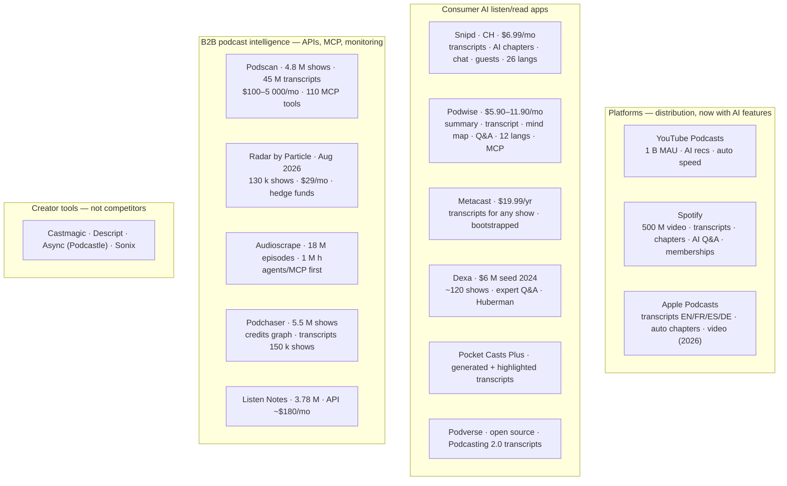

# 09 — Market research: who else is building "YouTube for podcasts with an AI layer"

*Web research performed 10 September 2026. Every figure below comes from a
public web source listed in §9 and was **not** verified first-party; vendor
self-reported numbers are marked as such. Several vendor sites (Dexa,
Podscan pricing, Metacast, Podchaser about) returned HTTP 403 to automated
fetches, so their figures come from third-party pages and should be
re-checked before they enter a pitch.*

The question asked: does a popular product already exist that does what
DOMOVINA.ai / Podcasterium does — a podcast platform ("a YouTube subset for
podcasts") with transcripts, AI articles, speaker identification, person
profiles and semantic search — aimed at the whole market of ~5 million
podcasts? Short answer in §1, evidence after.

---

## 1. Short answer

**Yes, many people think the same way, and the space is crowded — but nobody
ships the exact combination, and the consumer end of it is being absorbed by
the platforms.**

1. **The platforms already did the "YouTube for podcasts" part.** YouTube
   Podcasts reports 1 billion monthly active users and is the #1 podcast
   service for US weekly listeners (37 %). Spotify (500 M+ video podcast
   streamers) and Apple (video podcasts from spring 2026) followed. All three
   added **automatic transcripts and chapters in 2025–26**, Spotify added
   **in-app AI Q&A about the episode** (May 2026). Competing with them on
   distribution is not a strategy.
2. **The consumer "AI podcast reader" niche is occupied** by at least two
   mature apps: Snipd (Zurich, since 2021, transcripts + AI chapters + chat +
   guest cross-references, 26 languages) and Podwise (summaries, transcripts,
   mind maps, 111 k users self-reported). Both are small, subscription-funded
   and have not raised beyond pre-seed/seed. Metacast (bootstrapped,
   transcripts for any podcast at $19.99/yr) shows how thin the pricing power is.
3. **The money and momentum are in B2B "podcast intelligence"**: Podscan
   (4.8 M podcasts, 45 M transcripts, one founder, $100–5 000/mo), Radar by
   Particle (launched Aug 2026, 130 k podcasts, hedge funds as top customers),
   Audioscrape (18 M episodes, agent/MCP-first), Podchaser (5.5 M podcasts,
   credits graph, transcripts for 150 k shows), Listen Notes (3.78 M podcasts,
   API from ~$180/mo). Their common thesis — "AI agents are blind to audio" —
   is exactly DOMOVINA's thesis, and DOMOVINA already runs an MCP server.
4. **Nobody ships**: a structured *article by chapter* (not a transcript) **+**
   a person hub that unifies *speaks* and *is mentioned* with timestamps **+** a
   10-foot Android TV UI **+** open source **+** white-label for vertical
   communities. Each element exists somewhere; the combination does not. That
   is a real but narrow gap, and §7 says what it is worth.
5. **Cautionary tale**: Huxe (ex-NotebookLM founders, $4.6 M raised) shut
   down in May 2026 **one day after Spotify shipped the same feature**. Any
   consumer feature that a platform can clone in a quarter is not a moat.

---

## 2. Market size — what "TAM of 5 million podcasts" really means

| Measure | Value | Source (date) |
| :-- | --: | :-- |
| Podcast feeds, Podcast Index | 4.72 M | Libsyn 2026 stats, citing Podcast Index |
| Podcast feeds, Podscan | 4.80 M | Podscan live stats, 4 Aug 2026 |
| Podcasts, Podchaser | 5.5 M | Podchaser API page (self-reported) |
| Podcasts, Listen Notes | 3.78–3.79 M | Listen Notes (self-reported) |
| Podcasts, Apple index | ≈ 3.1 M | Podcast Industry Insights, Sep 2026 |
| Episodes | 166 M (Podcast Index) / 190 M (Listen Notes) / 131 M (Apple) | as above |
| **Active shows, 90 days** | **≈ 478 k** | Podcast Index via Libsyn |
| **Active shows, 30 days** | **≈ 323 k** | Podcast Index via Libsyn |
| New feeds launched, H1 2026 | 480 k | Podcast Industry Insights |
| New episodes per day | 14–35 k | Podscan (14.8 k on 7 Mar 2026; "35 k+" on marketing page) |
| US monthly listeners | 167 M (58 % of 12+) | Edison Infinite Dial 2026 |
| Global monthly listeners | 584 M | Edison, June 2026 |
| US podcast ad revenue 2026 | $3.0 B (+17.6 % YoY) | IAB/PwC |
| YouTube Podcasts MAU | 1 B | YouTube via TechCrunch, 28 May 2026 |
| YouTube Premium podcast hours, Apr 2026 | 800 M | same |
| Spotify users who streamed a video podcast | 500 M+ (+~50 % YoY) | Spotify Investor Day, 21 May 2026 |
| US weekly listeners' most-used service | YouTube 37 %, Spotify (overtaken), Apple 14 % | Edison 2026 via insideradio / podrewind |

Three consequences for the "5 M podcasts" TAM:

- **Only ~10 % of feeds are alive.** 478 k shows published in the last 90
  days. A processing pipeline that targets "all podcasts" is really targeting
  ~0.5 M shows and ~15–35 k new episodes per day. That is the number to
  size the pipeline on, not 5 M.
- **The long tail is huge and unprocessed.** Platforms auto-transcribe in a
  handful of languages (Apple: EN/FR/ES/DE). Podscan claims 15+ languages but
  sells B2B. Non-English long-tail shows — DOMOVINA's home turf — remain the
  least served segment.
- **Episodes, not shows, drive cost.** 166 M back-catalogue episodes × ASR +
  LLM is the real barrier; it is why B2B players sell *monitoring from today
  forward*, not back-catalogue reading. DOMOVINA's 3 036 h corpus cost is
  still unmeasured (doc 06 §5.1) and must be before any TAM claim.

---

## 3. Landscape by category

### 3.1 Platforms

| | What shipped | Relevance |
| :-- | :-- | :-- |
| **YouTube** | May 2026: AI recommendation tool, Auto speed, on-the-go mode for Premium; 1 B MAU on podcasts; 800 M Premium podcast hours in April 2026 | The literal "YouTube for podcasts" exists and is YouTube. Also DOMOVINA's content source (embed mode) |
| **Spotify** | Automated transcripts, chapters, guests and topics feed discovery; Investor Day May 2026: in-app AI Q&A about the episode, Prompted Playlists, Personal Podcasts, Memberships, Creator Sponsorships; 500 M+ video podcast streamers | Spotify now does *speaker/guest extraction* and *ask the episode* — two of DOMOVINA's features — at platform scale |
| **Apple** | Auto transcripts (EN/FR/ES/DE); iOS 26.2: auto-generated chapters, timed links; spring 2026: integrated video podcasts, PiP, offline video | Apple's language list shows the gap: everything outside those four languages |

### 3.2 Consumer AI listening/reading apps

| App | Model | Features overlapping DOMOVINA | Gap vs DOMOVINA | Notes |
| :-- | :-- | :-- | :-- | :-- |
| **Snipd** (Zurich, 2021) | freemium, $6.99/mo; free tier 2 AI episodes/week | transcripts with speaker ID, AI chapters, summaries, chat with episode, **guest info and cross-episode appearances**, book mentions, 26 languages, export to Notion/Obsidian/Readwise | no structured article, no "is mentioned" facet, no TV, closed source | €631 k pre-seed (2022); no later round found. Closest consumer competitor |
| **Podwise** | $5.90 Standard / $11.90 Pro / $299 Enterprise; 7-day trial | full transcript, summary, **mind map**, Q&A, search across library, 12 languages, MCP + CLI, Notion/Obsidian export; web + iOS + Android APK | no person hub, no video sync, no TV; per-episode credit model (20–50/mo) | 111 k users, 4.9★ from 2 000+ reviews (self-reported). Closest to "read instead of listen" |
| **Metacast** | Premium $19.99/yr (cut 60 % from $49.99 in Oct 2024; $9.99 first-year promo) | generated transcripts for any podcast, read-along, bookmarks | no AI article, no person hub | Two founders (ex-AWS), bootstrapped; their pricing history is a data point on consumer willingness to pay |
| **Dexa** (NYC, 2023) | early access / free for partner shows | AI answers attributed to experts, search by topic/guest, chapters | ~120 curated shows, not a player; no TV | $6 M seed (Feb 2024); powers ai.hubermanlab.com; site returned 403 — current status unverified |
| **Pocket Casts** (Automattic) | Plus/Patron | generated transcripts for select shows (Apr 2025), highlighted read-along (Jun 2026) | player-first; no AI article | Incumbent player adding the feature — another sign it is becoming table stakes |
| **Podverse** | open source (AGPL), free | Podcasting 2.0 transcripts and chapters when the publisher provides them | no AI processing of its own | The only open-source player in the comparison; no AI layer |
| **Fathom.fm** | — | AI previews, search, recommendations | — | Still listed; status unclear; not verified |

### 3.3 B2B podcast intelligence

| Company | Corpus (self-reported) | Pricing | Customer | Relevance |
| :-- | :-- | :-- | :-- | :-- |
| **Podscan.fm** (Arvid Kahl, solo founder) | 4.8 M podcasts, 45 M+ episode transcripts, 14–35 k new episodes/day, 15+ languages, entities, demographics, brand safety | from ~$100/mo, enterprise from $5 000/mo, $5 per 1 000 extra API calls, 50 % off for bootstrappers | brands, PR, agencies, AI agents (MCP server with 110 tools, Jun 2026) | Proves one person can transcribe the *whole active market*. Also a potential **corpus supplier** for Podcasterium (§7) |
| **Radar by Particle** (ex-Twitter founders) | 130 k podcasts incl. Apple Top 200 in 135 categories, 20 k episodes/day | $29/mo individual, $399/mo for 20 seats, custom API | hedge funds (highest volume), AI search, data resellers, journalists | Launched 26 Aug 2026 — the newest entrant, with the same "agents are blind to audio" thesis |
| **Audioscrape** | 18 M+ episodes searchable, 1 M+ hours indexed, 100 k+ hours fully transcribed with named speakers and entities; focus on top 100 US shows | plans on site (not fetched) | AI agents via API/MCP | Speaker attribution + entity linking = DOMOVINA's diarization + person hub, sold as data |
| **Podchaser** (Acast) | 5.5 M podcasts, "tens of millions" of host/guest/crew credits, transcripts for 150 k shows + 5-year backfill (2026) | Pro / API, on request | brands, agencies, discovery tools | **The incumbent person graph.** Their credits answer "where does X speak"; they do not answer "where is X mentioned" with a timestamp |
| **Listen Notes** (2017) | 3.78 M podcasts, 190 M episodes | free tier; production from ~$180/mo; 12 000+ API customers | developers | The reference podcast search API |
| Podengine, Podfetcher | search engine / API for agents | — | developers | Long tail of the same idea |

### 3.4 What died

**Huxe** — AI-generated personal podcasts, founded late 2024 by former
NotebookLM team, $4.6 M from Conviction and others. Shut down 22 May 2026,
the day after Spotify launched "Personal Podcasts". Lesson repeated by
TechCrunch and Failory: a consumer AI feature that a platform can replicate
becomes a platform feature.

---

## 4. Feature-by-feature: where DOMOVINA/Podcasterium stands

| Capability | DOMOVINA.ai today | Who else has it | Verdict |
| :-- | :-- | :-- | :-- |
| Transcript with named speakers | yes (pyannote + naming) | Snipd, Podscan, Audioscrape, Spotify (guests), Castmagic | **table stakes** |
| AI chapters | yes | Snipd, Spotify, Apple, Podwise | table stakes |
| Summary | yes | everyone | table stakes |
| **Structured article by chapter** (journalistic text, not transcript) | yes, 99.5 % of corpus | Podwise comes closest (summary + mind map); nobody else publishes a readable article | **differentiator, narrow** |
| Article ↔ video shared scroll, timestamp deep links with OG previews | yes | Snipd (audio), Metacast (read-along); video-synced article: none found | differentiator |
| Chapter → MP4 clip export | yes | Castmagic (creator-side), Snipd (quote cards) | minor |
| **Person hub: speaks ∪ is mentioned, with timestamps** | yes | Podchaser credits (speaks only, manual/curated); Podscan and Audioscrape (mentions, B2B); Snipd (guest appearances). Consumer product with both facets: **none found** | **differentiator, defensible for a corpus you own** |
| Keyword + semantic search with per-second deep links | yes | Dexa, Snipd chat, Spotify Q&A, Podscan, Radar | crowded |
| Android TV 10-foot UI | yes | YouTube, Spotify, Apple TV apps; **no startup** in this list | differentiator nobody contests |
| Background audio, PWA, handoff | yes | all players | table stakes |
| Domain scoring layer (Magisterium) | yes, 10 % of corpus | none | unique, vertical-only |
| Direct creator support without platform cut | Pinka (SEPA + on-chain) | Fountain (Bitcoin), Spotify Memberships, Patreon | niche |
| MCP server over the corpus | yes (`mcp.domovina.ai`) | Podscan, Podwise, Audioscrape, Radar | **on trend** — this is where 2026 money goes |
| Open source | planned for Podcasterium | Podverse, AntennaPod (players without AI) | **no open-source AI podcast reader exists** |
| White-label / vertical instances | the DOMOVINA → Podcasterium plan | none found | **no one does this** |
| Self-service ingestion, RSS | no | everyone in B2B | **gap against us** |
| Article in the source language | no (Croatian always) | platforms (4 langs), Podscan (15+) | **gap against us** |

---

## 5. Pricing reference points (consumer)

| Product | Price | Note |
| :-- | :-- | :-- |
| Snipd Premium | $6.99/mo | free: 2 AI episodes/week; premium capped at 900 AI minutes/mo |
| Podwise Standard / Pro | $5.90 / $11.90 per month (billed yearly $70.80 / $142.80) | 20 / 50 AI episodes per month |
| Metacast Premium | $19.99/yr ($1.99/mo); launched at $49.99/yr, cut 60 % | transcripts for any show, no ads |
| Pocket Casts Plus | existing tier | transcripts included |
| DOMOVINA Plus | €4.99/mo, €39.99/yr, €99.99 lifetime | two real benefits today (doc 05 §5) |
| Podscan (B2B) | $100–5 000/mo | monitoring, API |
| Radar (B2B) | $29/mo individual, $399/mo per 20 seats | |

Reading: consumer willingness to pay for "AI on podcasts" sits at **$2–7 per
month**, with per-episode credit caps as the cost control. DOMOVINA's €4.99 is
in range; the lifetime tier is unusual in this market.

---

## 6. Is there at least one other person who thinks like the owner?

Yes — at least a dozen funded or profitable teams, and the thesis is now
mainstream:

- Particle's Kayvon Beykpour (ex-Twitter product lead), Aug 2026: "agents are
  generally blind to audio; they can't see it unless something or someone has
  transcribed it."
- Arvid Kahl built Podscan alone to transcribe *every* active podcast and
  sells the result to brands and agents.
- Snipd and Podwise built the consumer reader; Metacast proved it can be
  bootstrapped and how little it can charge.
- Spotify, Apple and YouTube spent 2025–26 turning transcripts, chapters,
  guest extraction and AI Q&A into **free platform features**.

So the "5 M podcasts" ambition is shared. What is **not** shared is DOMOVINA's
angle: a *reading* product with an editorial article and a person graph, for a
*specific community and language*, on *every screen including TV*, with a
*domain-specific scoring layer*, and — for Podcasterium — *open source and
white-label*. Nobody found in this research is doing that.

---

## 7. Strategic implications for Podcasterium

1. **Do not position as "the AI podcast app" for everyone.** That shelf holds
   Snipd and Podwise below, and YouTube/Spotify/Apple above. A third generic
   consumer app with €5/mo pricing and no distribution is the Huxe pattern.
2. **Position as the open-source, white-label podcast *reader* engine for
   vertical communities and long-tail languages.** DOMOVINA is the first
   instance (Croatian Catholic). Other instances are obvious: a diocese or
   denomination, a national language with no platform transcripts, a
   professional field (medicine, law), a university. Nobody offers this.
   It fits the core-package architecture in doc 08 exactly: one core, N
   shells, N corpora.
3. **Buy the global corpus, do not build it.** To reach "5 M podcasts" the
   pipeline does not need to transcribe the world — Podscan already sells
   transcripts, entities and speaker data for 4.8 M shows via API, and Radar,
   Audioscrape, Podchaser and Listen Notes sell adjacent data. Podcasterium's
   pipeline value is the **article generation, chaptering, person graph and
   domain scoring on top of a transcript** — the part nobody sells. Evaluate
   Podscan API as the ingestion source for the global instance (cost per
   episode vs. own whisper/pyannote). This also dissolves the "article in
   the source language" blocker of doc 06 §5.1, because the transcript
   arrives in the source language already.
4. **Keep and grow the MCP server.** The B2B money in 2026 flows to whoever
   makes audio legible to agents. DOMOVINA already has `mcp.domovina.ai` with
   person and search tools; a Podcasterium-wide MCP over article-level
   (not transcript-level) knowledge is a product in itself and a way to
   monetize that does not depend on App Store conversion.
5. **Do not claim "first" anywhere.** Mention detection: Podscan, Audioscrape,
   Radar. Guest graph: Podchaser, Snipd. Transcripts: everyone. The honest
   claim is the combination plus openness plus TV plus vertical depth
   (doc 05 §5 rules stand).
6. **Watch the platform roadmap quarterly.** Spotify's May 2026 feature list
   (guests, topics, AI Q&A) removed two of DOMOVINA's differentiators in one
   release. The next likely ones: Apple adding more transcript languages, and
   YouTube adding AI chapters/summaries to podcasts. Each is a reason to move
   up the stack (article, person graph, domain score) and out of the player.

---

## 8. What remains unverified

| Claim | Why unverified | How to verify |
| :-- | :-- | :-- |
| Dexa current status, pricing, corpus | dexa.ai returned 403; third-party review sites disagree (free vs. paid) | open the site manually; check App Store listing |
| Podscan exact tier prices | podscan.fm/pricing returned 403; "$100/mo, $5 000 enterprise" from a directory page | open pricing page manually |
| Podchaser 5.5 M podcasts / 150 k transcripts | from search snippets of Podchaser pages, not the pages themselves | open features.podchaser.com/api |
| Podwise 111 k users, Snipd "App Store recognition" | vendor self-reported on landing pages | treat as marketing |
| Edison "YouTube 37 % most-used" | via insideradio/podrewind summaries of Infinite Dial 2026 | download the Infinite Dial 2026 deck |
| Global podcast market "$34.3 B → $318.5 B" (market.us) | analyst extrapolation with 25 % CAGR; not used in conclusions | ignore unless a VC asks |
| Audioscrape funding | Crunchbase not fetched | Crunchbase |
| Fathom.fm alive or not | only directory listings found | open the site |

---

## 9. Sources

Market size
- [Libsyn — Podcast Statistics 2026](https://libsyn.com/blog/podcast-statistics-2026-listeners-downloads-ad-spend-and-industry-growth/) (Podcast Index feeds/episodes/active, Edison listeners, IAB ad revenue)
- [Podcast Index — 24-hour new feeds report](https://public.podcastindex.org/24hourFeedReport.html)
- [Podder — Apple Podcasts statistics 2026](https://www.podderapp.com/post/apple-podcasts-podcast-stats)
- [Listen Notes API](https://www.listennotes.com/api/) · [Listen Notes review 2026 (PodPosted)](https://www.podposted.com/resources/listen-notes)
- [insideradio — Video reshapes podcasting (Edison 2026)](https://www.insideradio.com/free/video-reshapes-podcasting-as-audience-hits-new-high-study-finds/article_7bcc18a5-45a6-4a2a-98ba-0e137d7a62cb.html) · [PodRewind — platform market share 2026](https://podrewind.com/blog/podcast-platform-market-share-2026)

Platforms
- [TechCrunch — YouTube adds new podcast features (28 May 2026)](https://techcrunch.com/2026/05/28/youtube-adds-new-podcast-features-including-an-ai-recommendation-tool-and-auto-speed/)
- [Spotify Newsroom — Investor Day podcast features (21 May 2026)](https://newsroom.spotify.com/2026-05-21/investor-day-podcast-features-updates/) · [Spotify for Creators — automated transcripts & chapters](https://creators.spotify.com/resources/grow/automated-transcripts-chapters)
- [CNBC — Apple video podcasting push (16 Feb 2026)](https://www.cnbc.com/2026/02/16/apple-takes-on-youtube-and-spotify-with-new-video-podcasting-push.html) · [TechBuzz — Apple Podcasts auto chapters](https://www.techbuzz.ai/articles/apple-podcasts-gets-auto-generated-chapters-and-timed-links) · [Apple — Transcripts on Apple Podcasts](https://podcasters.apple.com/support/5316-transcripts-on-apple-podcasts)

Consumer apps
- [Snipd](https://www.snipd.com) · [Snipd pricing (Headway)](https://makeheadway.com/blog/snipd-pricing-features/) · [EU-Startups — Snipd pre-seed (2022)](https://www.eu-startups.com/2022/03/zurich-based-snipd-raises-e631k-for-its-ai-powered-podcast-player/)
- [Podwise](https://podwise.ai/) · [Podwise review (Cascade Insights)](https://www.cascadeinsights.com/a-market-researchers-review-podwise)
- [Metacast](https://metacast.app/) · [Metacast — dropping the price 60 %](https://www.metacastpodcast.com/p/dropping-the-price-october-2024) · [Metacast pricing](https://metacast.app/pricing)
- [TechCrunch — Dexa raises $6 M (Feb 2024)](https://techcrunch.com/2024/02/05/dexa-aims-to-get-more-out-of-podcasts-with-ai-powered-search) · [Dexa review 2026 (aichief)](https://aichief.com/ai-audio-tools/dexa-ai/)
- [Pocket Casts — highlighted transcripts (Jun 2026)](https://blog.pocketcasts.com/2026/06/24/highlighted-transcripts/) · [Pocket Casts — generated transcripts (Apr 2025)](https://blog.pocketcasts.com/2025/04/29/generated-transcripts-are-here/)
- [Podverse](https://podverse.fm/) · [AntennaPod](https://antennapod.org/)
- Comparison pages: [Podshot — AI podcast apps 2026](https://www.podshot.ai/compare/ai-podcast-apps-2026) · [MurmurCast — summarizers 2026](https://murmurcast.com/blog/best-ai-podcast-summarizers-2026) · [BibiGPT — summarizer tools 2026](https://bibigpt.co/en/blog/posts/best-ai-podcast-summarizer-tools-2026)

B2B intelligence
- [Podscan.fm](https://podscan.fm/) · [Podscan MCP server](https://podscan.fm/docs/mcp-server) · [Podscan REST API](https://podscan.fm/rest-api) · [Podscan on IndieAI (pricing)](https://indieai.directory/tools/podscan/) · [The Bootstrapped Founder — Podscan, one month in](https://thebootstrappedfounder.com/podscan-one-month-in/)
- [TechCrunch — Radar makes podcasts searchable (26 Aug 2026)](https://techcrunch.com/2026/08/26/radar-makes-podcasts-searchable-and-usable-by-ai-agents/)
- [Audioscrape](https://www.audioscrape.com/) · [Audioscrape API docs](https://www.audioscrape.com/docs/api)
- [Podchaser API](https://features.podchaser.com/api/) · [Podchaser creator credits](https://www.podchaser.com/about/credits) · [Podchaser review 2026 (PodPosted)](https://www.podposted.com/resources/podchaser)
- [Pod Engine](https://www.podengine.ai/solutions/podcast-api) · [Podfetcher](https://www.podfetcher.com/)

Cautionary tale
- [TechCrunch — Huxe shuts down (22 May 2026)](https://techcrunch.com/2026/05/22/audio-generation-app-huxe-founded-by-former-notebooklm-developers-shuts-down/) · [Failory — Turned into a feature](https://newsletter.failory.com/p/turned-into-a-feature)
