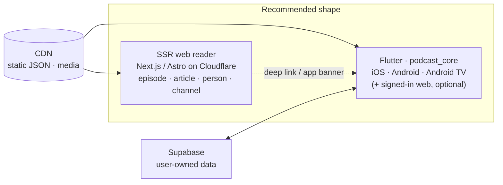

# 10 — Technology stack review: is Flutter still the right choice?

*Written 11 September 2026 against `domovina.ai` `main` @ `cfb45aa`
(Flutter 3.47.3 / Dart 3.13.3). Every count is reproduced by §7. Effort
figures are estimates.*

The plan in this repository (`08-white-label-architecture.md`) keeps the
Flutter codebase of DOMOVINA.ai and turns it into a `podcast_core` package.
This document asks the question that plan takes for granted: **given what
the application actually does, would a more native technology for iOS,
Android and the web be the wiser choice today?**

---

## 1. Short answer

- **For this project: keep Flutter for iOS, Android and Android TV.** Nothing
  in the feature set needs a native toolkit, the release pipeline exists, and
  a rewrite of ≈ 59 k lines buys no product the user would pay for.
- **The weak point is the web**, and it is exactly where Podcasterium wants
  to be strongest: reading long articles, being found by search engines,
  sharing links. That weakness is fixed by a **separate server-rendered web
  front for the public reader**, not by changing the mobile stack.
- **For a greenfield product with this feature set in 2026** the best
  economic choice for a small team would be web-first (Next.js or Astro on
  Cloudflare) plus Expo / React Native for mobile and TV, sharing TypeScript
  with the backend. Three native codebases (SwiftUI, Jetpack Compose, web)
  are technically the best and only make sense with three teams.

---

## 2. What the application demands from a platform

From `00-source-app-analysis.md` and the upstream `pubspec.yaml`
(32 runtime dependencies):

| Requirement | How "native-hungry" | How Flutter covers it today |
| :-- | :-- | :-- |
| Video player, fullscreen, picture-in-picture | medium | `media_kit` + `floating`; in production, works |
| Background audio, lock-screen controls | medium | `audio_service`; works. CarPlay / Android Auto are not implemented |
| Long text articles, chapters, subtitles | low on mobile, **high on the web** | Web renders through CanvasKit / Skwasm, not the DOM: no real SEO, weaker text selection and accessibility, heavy first load |
| Android TV (Leanback) | medium | `lib/screens/tv/` and related files: 15 Dart files, 6,144 LOC of hand-written focus handling; works |
| Apple TV (tvOS) | **not supported by Flutter** | None. If tvOS matters, another stack is needed for it |
| Auth: Google, Apple, magic link, passkeys | low | plugins; works |
| RevenueCat, Supabase, go_router, i18n (1,010 keys) | low | works |

Conclusion: **nothing in the feature set requires native code except tvOS.**
The one real architectural weakness is the web, and it is already visible in
the code: `web/_worker.js` has 1,529 lines, most of them compensating for
what a server-rendered framework provides for free — Open Graph injection,
sitemap, AASA / asset links, SPA fallback.

---

## 3. Stack comparison, September 2026

| Criterion | Flutter | Expo / React Native | Kotlin Multiplatform + Compose MP | Native ×3 (SwiftUI, Compose, web) | Web-first PWA + Capacitor |
| :-- | :-- | :-- | :-- | :-- | :-- |
| iOS + Android quality | very good | very good (New Architecture) | very good on Android, good on iOS | best | weak (player, background audio) |
| Web with SEO for articles | weak | good (Next.js via react-native-web, or a separate web app) | weak (Wasm, experimental) | best | best |
| Android TV | good, hand-written | good (`react-native-tvos`) | possible, few examples | best | no |
| Apple TV | no | yes (`react-native-tvos`) | no | yes | no |
| Video, PiP, background audio | mature | mature (`react-native-video`, `react-native-track-player`) | partial, native bridges | native | limited |
| One language for backend and client | no (Dart) | **yes** (TypeScript, Cloudflare Workers) | no | no | yes |
| Cost for a solo / small team | low | low | medium | **3× code, 3× release pipeline** | lowest |
| Platform risk | Google invests less than in 2022, but stable | Meta + Expo, largest ecosystem | JetBrains, growing | none | none |

---

## 4. Why not rewrite

- **Production code exists**: 58,648 LOC, 331 passing tests, App Store,
  Google Play and web deployments, a nightly gate. A rewrite of that scope is
  a rough estimate of **8–14 person-months** for one person who knows the
  domain, with zero new features. The "no fork, `podcast_core`" decision in
  `DECISIONS.md` exists precisely to avoid that cost.
- **Native ×3 does not yield 3× the product.** It buys a better feel on iOS
  (system design language, latest widgets) and tvOS. A podcast-reader user
  pays for a reliable player, a fast article and being findable on Google,
  not for that.
- **Flutter's weak web is not a reason to change the mobile stack**, because
  the web problem is solved separately and more cheaply (§5).

---

## 5. Recommendation for Podcasterium

1. **Mobile and Android TV: Flutter, `podcast_core`**, as already decided.
   Nothing in the feature set justifies a change.
2. **Public web reader: a separate server-rendered front** (Next.js or Astro
   on Cloudflare Pages / Workers) that reads the **same static CDN JSON
   contract** the app already consumes. The client is a read-only client over
   a static CDN contract (`00-source-app-analysis.md` §1), so this is a
   natural seam: episode, article, person and channel pages become real HTML
   with Open Graph, sitemap, JSON-LD and indexable text. Flutter web stays for
   the signed-in part (favorites, progress, subscription) or is retired over
   time.
3. **tvOS: skip** until there is evidence of demand. If it appears, the
   cheapest path is a small SwiftUI client over the same CDN contract, not a
   change of the main stack.
4. **If a rewrite ever happens**, the only candidate that makes sense is
   **Expo + Next.js in TypeScript**, because backend (Cloudflare Workers),
   web and mobile then share a language, types and part of the code. Not
   before the web reader from step 2 has proven its worth.



---

## 6. What this does not decide

- Which SSR framework (Next.js vs Astro) — a separate, later decision, after
  the `podcast_core` extraction and the first store build.
- Whether the signed-in web experience stays Flutter web or moves to the SSR
  front.
- Anything about the pipeline, corpus or output language
  (`06-backend-and-corpus.md`).

---

## 7. Reproducing the numbers

All commands run from `/Users/ms/git/domovinatv/domovina.ai` at `cfb45aa`.

```bash
git rev-parse --short HEAD                                                 # cfb45aa
wc -l web/_worker.js                                                       # 1529
find lib -name '*.dart' -path '*tv*' | wc -l                               # 15
find lib -name '*.dart' -path '*tv*' | xargs wc -l | tail -1               # 6144
sed -n '/^dependencies:/,/^dev_dependencies:/p' pubspec.yaml \
  | grep -c -E '^  [a-z_]+:'                                               # 32
```

LOC (58,648), test count (331) and translation keys (1,010) are reproduced
in `00-source-app-analysis.md` §9.
